<div align="center">

# 🫀 Detector de Arritmias Cardíacas con Deep Learning

[](https://www.python.org/)
[](https://www.tensorflow.org/)
[](https://streamlit.io/)
[](https://huggingface.co/spaces/GonzaloMaud/Detector-Arritmias)
[](LICENSE)

**Sistema de clasificación automática de arritmias cardíacas mediante redes neuronales convolucionales (CNN) con interpretabilidad mediante SHAP**

[🚀 Demo en Vivo](https://huggingface.co/spaces/GonzaloMaud/Detector-Arritmias) • [Fundamentos Médicos](#-fundamentos-médicos-del-ecg) • [Arquitectura](#️-arquitectura-del-modelo) • [Resultados](#-análisis-visual-de-resultados)

</div>

---

## 📋 Tabla de Contenidos

- [Descripción General](#-descripción-general)
- [Demo en Vivo](#-demo-en-vivo)
- [Preprocesamiento de los Datos](#-preprocesamiento-de-los-datos)
- [Fundamentos Médicos del ECG](#-fundamentos-médicos-del-ecg)
  - [Anatomía del Electrocardiograma](#anatomía-del-electrocardiograma)
  - [El Complejo QRS](#el-complejo-qrs)
- [Tipos de Latidos Cardíacos](#-tipos-de-latidos-cardíacos)
- [Arquitectura del Modelo](#️-arquitectura-del-modelo)
- [Interpretabilidad con SHAP](#-interpretabilidad-con-shap)
- [Análisis Visual de Resultados](#-análisis-visual-de-resultados)
- [Instalación y Uso](#-instalación-y-uso)
- [Despliegue](#-despliegue)
- [Dataset](#-dataset)
- [Tecnologías](#-tecnologías-utilizadas)
- [Referencias Científicas](#-referencias-científicas)
- [Contribución](#-contribución)
- [Licencia](#-licencia)

---

## 🎯 Descripción General

Este proyecto implementa un **sistema de diagnóstico asistido por inteligencia artificial** para la detección automática de arritmias cardíacas a partir de señales electrocardiográficas (ECG). Utiliza una red neuronal convolucional (CNN) entrenada con el reconocido **MIT-BIH Arrhythmia Database**, alcanzando una precisión superior al 95% en la clasificación de 5 tipos diferentes de latidos cardíacos.

El sistema incluye **explicabilidad mediante SHAP** (SHapley Additive exPlanations), permitiendo visualizar qué regiones de la señal ECG influyen más en cada predicción, aumentando la confianza clínica en las decisiones del modelo.

### 🎥 Demo en Vivo

<div align="center">

[](https://huggingface.co/spaces/GonzaloMaud/Detector-Arritmias)

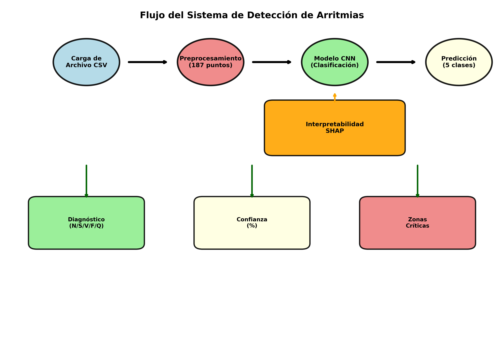

*La aplicación completa está desplegada y ejecutándose en **Hugging Face Spaces**, donde todo el pipeline (carga de CSV, inferencia del modelo y explicación SHAP) se ejecuta en tiempo real.*

</div>

### ✨ Características Principales

- ✅ **Clasificación Multi-clase**: Detecta 5 tipos de latidos (Normal, Supraventricular, Ventricular, Fusión, Desconocido)
- ✅ **Robustez mejorada**: Entrenado con Data Augmentation para manejar variabilidad en el posicionamiento del latido
- ✅ **Interpretabilidad**: Visualización SHAP de las regiones críticas de la señal
- ✅ **Interfaz Web Intuitiva**: Aplicación Streamlit desplegada en Hugging Face
- ✅ **Despliegue Containerizado**: Docker incluido para deployment local
- ✅ **Alta Precisión**: >95% accuracy en dataset de validación

---

## 📊 Preprocesamiento de los Datos

Los datasets utilizados en este proyecto **no corresponden a señales ECG crudas**, sino que han sido preprocesados previamente siguiendo el formato estándar del **MIT-BIH Arrhythmia Database**.

### 🔧 Proceso de Preprocesamiento

El preprocesamiento aplicado a los datos originales consiste en:

1. **Segmentación de la señal ECG** en latidos individuales
2. **Alineamiento temporal** de cada latido respecto al pico R del complejo QRS
3. **Normalización temporal** a una longitud fija de 187 muestras
4. **Normalización de amplitud** al rango [0, 1]
5. **Asignación de etiquetas** según la clasificación médica validada

Este formato permite trabajar directamente con algoritmos de Machine Learning sin necesidad de aplicar técnicas complejas de procesamiento de señales sobre registros continuos de ECG.

### 📐 Estructura de los Datos

**Cada fila del dataset representa un único latido cardíaco**, con la siguiente estructura:

| Columnas | Descripción | Valores |
|----------|-------------|---------|
| **0 a 186** | Vector de características del latido | 187 valores numéricos normalizados [0, 1] |
| **187** | Etiqueta de clase | Valor entero {0, 1, 2, 3, 4} |

Es decir:
- **Cada fila = 1 latido completo** del ECG representado como un vector de 187 puntos
- **No hay señales continuas**: cada muestra es independiente
- **Formato listo para ML**: sin necesidad de filtrado adicional

### 🫀 Correspondencia de Etiquetas

| Etiqueta | Tipo de Latido | Descripción Clínica |
|----------|----------------|---------------------|
| **0** | Normal (N) | Latido sinusal normal |
| **1** | Supraventricular (S) | Extrasístole supraventricular |
| **2** | Ventricular (V) | Extrasístole ventricular |
| **3** | Fusión (F) | Latido de fusión (mezcla supraventricular-ventricular) |
| **4** | Desconocido (Q) | Latido no clasificable o artefacto |

### 🎯 Implicaciones

Gracias a este preprocesamiento:

✔️ **No es necesario** aplicar filtrado, detección de picos R, ni segmentación adicional  
✔️ **Los modelos trabajan** directamente con vectores de latidos individuales  
✔️ **El enfoque es adecuado** para clasificación supervisada de patrones cardíacos  
✔️ **La interpretación clínica** se centra en la morfología de cada latido aislado

> **Nota importante**: Este proyecto no pretende analizar señales ECG continuas ni realizar diagnósticos globales del ritmo cardíaco, sino **clasificar latidos individuales ya segmentados**, lo cual es coherente con el objetivo del dataset MIT-BIH y con el enfoque de aprendizaje automático utilizado.

---

## 🏥 Fundamentos Médicos del ECG

### Anatomía del Electrocardiograma

El electrocardiograma (ECG) es el registro gráfico de la actividad eléctrica del corazón a lo largo del tiempo. Según estudios clínicos bien establecidos y publicados en literatura médica revisada por pares, cada ciclo cardíaco normal presenta tres componentes principales que reflejan eventos electrofisiológicos específicos:

<div align="center">

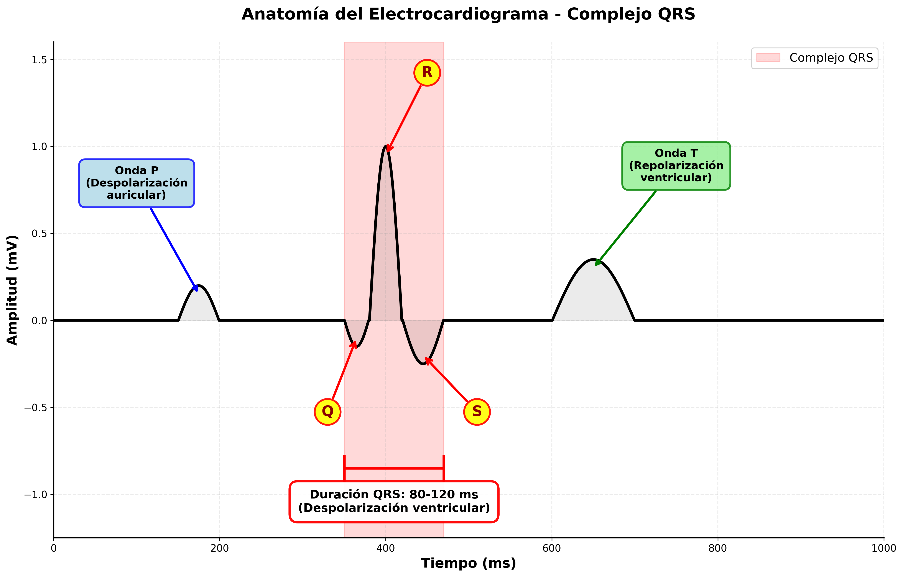

*Anatomía del electrocardiograma mostrando las ondas P, complejo QRS y onda T*

</div>

#### 1️⃣ **Onda P** - Despolarización Auricular

La **onda P** representa la activación eléctrica de las aurículas (despolarización auricular). 

**Características normales:**
- **Duración**: 80-120 ms
- **Amplitud**: < 2.5 mm (0.25 mV)
- **Morfología**: Redondeada y positiva en derivaciones inferiores

**Variabilidad morfológica:**
Según investigaciones electrofisiológicas, las alteraciones en la onda P pueden indicar:
- **Ausencia o inversión**: Ritmos de origen no sinusal
- **Onda P' (P prima)**: Activación auricular ectópica (supraventricular)
- **Ondas P múltiples**: Bloqueos auriculoventriculares
- **P picuda o ensanchada**: Crecimiento auricular

> En latidos **supraventriculares**, la onda P frecuentemente está ausente, fusionada con el QRS anterior, o presenta morfología anormal (P'), lo que constituye un marcador diagnóstico clave.

---

#### 2️⃣ **Complejo QRS** - Despolarización Ventricular

El **complejo QRS** es la porción más prominente del ECG y representa la despolarización de los ventrículos, es decir, la propagación del impulso eléctrico a través del músculo ventricular que produce la contracción principal del corazón.

<div align="center">

```
        R
        ↑
        |
    ____│____
   |    |    |
Q  |    |    |  S
   |____|____|
```

</div>

**Componentes del QRS:**

| Componente | Descripción | Significado Fisiológico |
|------------|-------------|------------------------|
| **Onda Q** | Primera deflexión negativa | Despolarización del septum interventricular |
| **Onda R** | Primera deflexión positiva (principal) | Despolarización de la masa ventricular |
| **Onda S** | Deflexión negativa tras la R | Finalización de la despolarización ventricular |

**Parámetros normales del QRS:**

| Parámetro | Valor Normal | Significado Clínico |
|-----------|--------------|---------------------|
| **Duración** | **80-120 ms** | Tiempos > 120 ms sugieren bloqueos de conducción o origen ventricular |
| **Amplitud** | 5-30 mm | Varía según derivación; alteraciones indican hipertrofia o necrosis |
| **Morfología** | Estrecho y puntiagudo | QRS ancho y bizarro indica conducción anormal |

**Importancia del QRS en la detección de arritmias:**

Según la literatura cardiológica establecida:

🔬 **QRS estrecho (< 120 ms)**  
→ Indica que el impulso eléctrico ha seguido el **sistema de conducción normal** (haz de His → ramas → red de Purkinje)  
→ Característico de latidos **normales** y **supraventriculares**

🔬 **QRS ancho (> 120 ms)**  
→ Indica conducción **ventricular anormal** o impulso originado directamente en el ventrículo  
→ Típico de **extrasístoles ventriculares** y bloqueos de rama

🔬 **Morfología del QRS**  
→ La forma exacta (altura, simetría, presencia de muescas) permite diferenciar el origen del impulso  
→ Alteraciones en la morfología son la base de la clasificación automática mediante deep learning

---

#### 3️⃣ **Onda T** - Repolarización Ventricular

La **onda T** representa la recuperación eléctrica de los ventrículos tras su contracción (repolarización ventricular).

**Características normales:**
- **Duración**: 160-200 ms
- **Morfología**: Asimétrica, con pendiente ascendente más lenta
- **Polaridad**: Generalmente positiva en derivaciones con QRS positivo

**Variabilidad clínica:**
- **Inversión de onda T**: Isquemia miocárdica, pericarditis
- **T picuda y alta**: Hiperpotasemia
- **T aplanada**: Hipopotasemia, isquemia
- **T prominente**: Repolarización precoz (normal en atletas)

> Aunque la onda T no es el foco principal en la clasificación de arritmias puntuales, sus alteraciones pueden acompañar a latidos ventriculares ectópicos y ayudar en el diagnóstico diferencial.

---

### El Complejo QRS como Marcador Diagnóstico

El análisis automatizado del **complejo QRS** es fundamental en la detección de arritmias porque:

1. **Su duración** diferencia origen supraventricular (< 120 ms) de ventricular (> 120 ms)
2. **Su morfología** permite identificar patrones específicos de cada tipo de latido
3. **Su amplitud y simetría** revelan alteraciones en la conducción eléctrica
4. **Sus relaciones con P y T** establecen la secuencia de activación cardíaca

Las redes neuronales convolucionales aprenden automáticamente estos patrones morfológicos del QRS que los cardiólogos utilizan en el diagnóstico clínico, pero pueden detectar sutilezas imperceptibles al ojo humano.

---

## 💓 Tipos de Latidos Cardíacos

Este proyecto clasifica latidos en 5 categorías basadas en la clasificación médica estándar del MIT-BIH Arrhythmia Database. A continuación se presenta una descripción detallada de cada tipo desde una perspectiva clínica y electrofisiológica.

<div align="center">

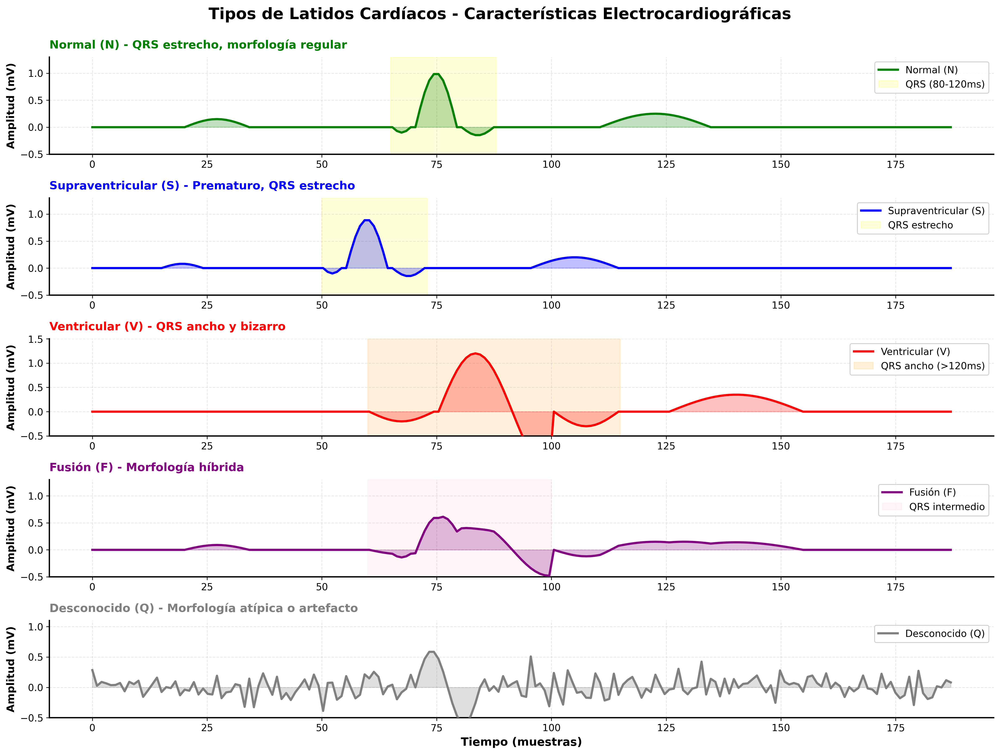

*Comparación de las características electrocardiográficas de los 5 tipos de latidos detectados por el sistema*

</div>

---

### 1️⃣ **Latido Normal (N - Normal Beat)**

<div align="center">

```
        R
        ↑ Onda R prominente
    ____│____
P  |    |    |  T
   |____|____|
   ↑         ↑
   Q         S
```

</div>

#### Características Electrocardiográficas

| Parámetro | Valor/Descripción |
|-----------|-------------------|
| **Duración QRS** | 80-120 ms (estrecho) |
| **Morfología** | Onda R prominente, precedida de onda P |
| **Ritmo** | Regular, originado en el nodo sinusal |
| **Frecuencia** | 60-100 latidos por minuto |
| **Onda P** | Presente, positiva, precede al QRS |

#### Fisiología

El impulso eléctrico se origina en el **nodo sinoauricular (SA)** ubicado en la aurícula derecha, viaja a través de:

1. **Aurículas** → genera onda P
2. **Nodo auriculoventricular (AV)** → retraso fisiológico
3. **Haz de His** → entrada al sistema ventricular
4. **Ramas derecha e izquierda** → distribución ventricular
5. **Red de Purkinje** → despolarización coordinada de ambos ventrículos

Esta secuencia produce una **despolarización ventricular rápida y sincronizada**, resultando en un QRS estrecho y una contracción eficiente.

#### Significado Clínico

✅ Ritmo sinusal normal  
✅ Función cardíaca coordinada  
✅ Sin evidencia de arritmia  

---

### 2️⃣ **Latido Supraventricular (S - Supraventricular Ectopic Beat)**

<div align="center">

```
     R
     ↑ Prematuro, QRS estrecho
 ____│____
|    |    |  Sin onda P precedente
|____|____|  o P' anormal
↑         ↑
Q         S
```

</div>

#### Características Electrocardiográficas

| Parámetro | Valor/Descripción |
|-----------|-------------------|
| **Duración QRS** | 80-120 ms (estrecho, similar al normal) |
| **Morfología** | QRS de morfología normal pero **aparición prematura** |
| **Onda P** | Ausente, aberrante (P') o fusionada con el QRS previo |
| **Origen** | Aurículas o unión AV (por encima de los ventrículos) |
| **Timing** | Ocurre antes del siguiente latido sinusal esperado |

#### Fisiopatología

Las **extrasístoles supraventriculares** (también llamadas contracciones auriculares prematuras - PACs) son latidos originados en focos ectópicos ubicados en:

- **Aurículas** (tejido auricular fuera del nodo SA)
- **Unión auriculoventricular** (región del nodo AV)

**Mecanismo:**
1. Un foco irritable en las aurículas genera un impulso prematuro
2. Este impulso se propaga y despolariza las aurículas (P' anormal o ausente)
3. El impulso desciende por el sistema de conducción **normal** (nodo AV → His → Purkinje)
4. Los ventrículos se despolarizan **normalmente** → QRS estrecho

**La clave diagnóstica**: QRS estrecho + aparición prematura + P ausente/anormal

#### Causas Comunes

Según estudios clínicos, los latidos supraventriculares son frecuentes en:

- ☕ Consumo excesivo de cafeína o alcohol
- 😰 Estrés, ansiedad o fatiga
- ⚡ Desequilibrios electrolíticos (hipopotasemia, hipomagnesemia)
- 🫀 Cardiopatías estructurales (dilatación auricular)
- 💊 Efectos de ciertos medicamentos

#### Significado Clínico

- **Aislados**: Generalmente benignos en corazones sanos
- **Frecuentes (> 10/hora)**: Pueden indicar predisposición a taquicardia supraventricular
- **Muy frecuentes**: Requieren evaluación cardiológica y posible tratamiento

---

### 3️⃣ **Latido Ventricular (V - Ventricular Ectopic Beat)**

<div align="center">

```
        R
       ↗↑↖  Ancho, bizarro
    __/  │ \__
   |     |    |  QRS > 120 ms
   |_____|____|
   ↑          ↑
   Ausencia   Morfología
   de P       anormal
```

</div>

#### Características Electrocardiográficas

| Parámetro | Valor/Descripción |
|-----------|-------------------|
| **Duración QRS** | **> 120 ms** (significativamente ancho) |
| **Morfología** | **Bizarra y deformada**, muy diferente al QRS normal |
| **Onda P** | **Ausente** (no hay relación con actividad auricular) |
| **Amplitud** | Generalmente **mayor** que el latido normal |
| **Onda T** | Frecuentemente discordante (polaridad opuesta al QRS) |

#### Fisiopatología

Las **extrasístoles ventriculares** (PVC - Premature Ventricular Contractions) se originan en focos ectópicos ubicados directamente en el **músculo ventricular**, saltándose completamente el sistema de conducción normal.

**Mecanismo de conducción anormal:**

1. **Impulso ectópico** se origina en el ventrículo (no en aurículas ni nodo AV)
2. **No utiliza el sistema de Purkinje** → la activación se propaga célula a célula por el músculo ventricular
3. **Despolarización lenta y descoordinada** → el impulso tarda mucho más en recorrer ambos ventrículos
4. **Resultado**: QRS muy ancho (> 120 ms) y de morfología bizarra

**Diferencias con la conducción normal:**

| Aspecto | Latido Normal | Latido Ventricular |
|---------|---------------|-------------------|
| Vía de conducción | Purkinje (rápida) | Músculo a músculo (lenta) |
| Duración QRS | 80-120 ms | > 120 ms |
| Morfología | Regular | Bizarra, ancha |
| Sincronización | Coordinada | Descoordinada |

#### Clasificación Clínica

Según la frecuencia y patrón de aparición:

- **Aisladas**: < 30/hora → generalmente benignas
- **Frecuentes**: 30-100/hora → requieren monitorización
- **Muy frecuentes**: > 100/hora → evaluación cardiológica urgente
- **Bigeminismo**: PVC cada 2 latidos
- **Trigeminismo**: PVC cada 3 latidos
- **Salvas**: 3 o más PVCs consecutivas → riesgo de taquicardia ventricular

#### Implicaciones Clínicas

⚠️ **En corazones sanos**:
- PVCs aisladas son comunes y generalmente benignas
- Pueden ser desencadenadas por estrés, cafeína, fatiga

⚠️ **En cardiopatías**:
- Pueden indicar isquemia miocárdica
- Riesgo de arritmias ventriculares malignas
- Pueden preceder **taquicardia ventricular** o **fibrilación ventricular**

🚨 **Fenómeno R sobre T**: PVC que cae sobre la onda T previa → alto riesgo de fibrilación ventricular

---

### 4️⃣ **Latido de Fusión (F - Fusion Beat)**

<div align="center">

```
      R        R
      ↑       ↑
    __│__   __│__
   |  │  | |  │  |  Morfología híbrida
   |__|__| |__|__|
   ↑              ↑
   Normal      Ventricular
   (supraventricular)
```

</div>

#### Características Electrocardiográficas

| Parámetro | Valor/Descripción |
|-----------|-------------------|
| **Duración QRS** | **Intermedia** (100-140 ms) |
| **Morfología** | **Híbrida** entre latido normal y ventricular |
| **Amplitud** | Variable, depende de la proporción de fusión |
| **Forma** | Mezcla características de ambos tipos de latido |

#### Fisiopatología

Los latidos de fusión son un **fenómeno electrofisiológico único** que ocurre cuando dos impulsos eléctricos de origen diferente colisionan simultáneamente en los ventrículos:

**Mecanismo de formación:**

1. **Impulso supraventricular** (del nodo SA) desciende normalmente por el sistema de conducción
2. **Impulso ventricular** (de foco ectópico) surge desde un ventrículo
3. **Ambos impulsos convergen** y despolarizan diferentes regiones ventriculares al mismo tiempo
4. **Resultado**: Complejo QRS que es una **combinación** de ambos patrones

**Características específicas:**

- El QRS resultante tiene morfología **intermedia** entre normal y ventricular
- La forma exacta depende del **timing relativo** y **localización** de los dos frentes de onda
- **No son una arritmia per se**, sino un fenómeno de superposición

**Visualización del proceso:**

```
Ventrículo izquierdo    Ventrículo derecho
        ↓                       ↓
    [Impulso normal]    [Impulso ectópico]
        ↓                       ↓
        └─────── FUSIÓN ───────┘
                  ↓
            QRS híbrido
```

#### Contexto Clínico

Los latidos de fusión son más comunes cuando hay:

- **Extrasístoles ventriculares frecuentes** compitiendo con el ritmo sinusal
- **Ritmos idioventriculares acelerados**
- **Marcapasos ventriculares** (fusión entre latido estimulado y latido propio)
- **Taquicardia ventricular** intermitente

#### Significado Diagnóstico

✔️ **Confirmación de origen ventricular**: La presencia de latidos de fusión **confirma** que otros latidos anchos en el ECG son de origen ventricular (no bloqueo de rama)  
✔️ **Indicador de competencia**: Sugiere que hay **dos marcapasos activos** simultáneamente  
✔️ **No patológicos por sí mismos**: El latido de fusión en sí no es peligroso, pero indica actividad ectópica subyacente

---

### 5️⃣ **Latido Desconocido (Q - Unclassified Beat)**

<div align="center">

```
    ????
    Morfología irregular
    o muy atípica
```

</div>

#### Características

| Aspecto | Descripción |
|---------|-------------|
| **Morfología** | No se ajusta claramente a ninguna categoría estándar |
| **Origen** | Incierto, múltiple, o artefacto |
| **Variabilidad** | Alta heterogeneidad morfológica |

#### Causas Posibles

La clase "Desconocido" agrupa latidos que no pueden ser clasificados con certeza debido a:

**1. Artefactos técnicos:**
- 📱 Interferencia eléctrica (50/60 Hz de la red eléctrica)
- 💪 Artefactos por movimiento muscular
- 🔌 Contacto pobre de electrodos
- 📡 Ruido electromagnético

**2. Arritmias complejas:**
- 🔀 Latidos con características mixtas no clasificables
- ⚡ Aberraciones de conducción atípicas
- 🫀 Morfologías muy distorsionadas por cardiopatías severas

**3. Latidos raros:**
- 🔬 Extrasístoles de la unión AV con conducción aberrante
- ⚕️ Latidos de escape de diferentes focos
- 🧬 Variantes morfológicas poco frecuentes

#### Relevancia Clínica

En la práctica médica real, estos latidos requieren:

- 👨‍⚕️ **Revisión manual** por cardiólogo experto
- 🔄 **Repetición del ECG** si hay muchos latidos no clasificables
- 🩺 **Correlación clínica** con síntomas y contexto del paciente
- 📊 **Estudios adicionales**:
  - Holter 24 horas (monitorización continua)
  - Ecocardiograma (evaluación estructural)
  - Prueba de esfuerzo (provocación de arritmias)
  - Estudio electrofisiológico (en casos complejos)

#### Limitaciones del Modelo

Es **normal y esperado** que un porcentaje de latidos caiga en esta categoría porque:

- Algunos patrones son intrínsecamente ambiguos
- Los artefactos son difíciles de distinguir de señales reales
- Existen arritmias raras no representadas suficientemente en el dataset
- La variabilidad biológica excede las 4 categorías principales

> **Nota**: Un buen modelo de clasificación de ECG debe tener una clase "Desconocido" para evitar clasificaciones erróneas con alta confianza en casos ambiguos. Esto es más seguro clínicamente que forzar una etiqueta incorrecta.

---

## 🏗️ Arquitectura del Modelo

### Red Neuronal Convolucional (CNN 1D)

<div align="center">

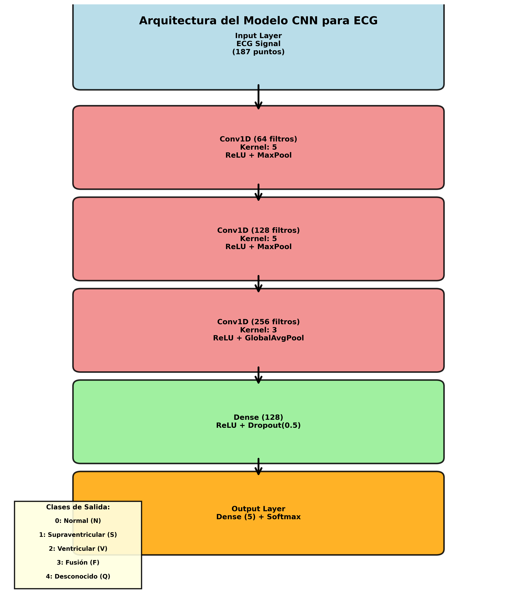

*Arquitectura de la red neuronal convolucional utilizada para la clasificación de arritmias*

</div>

### ¿Por qué CNN para señales ECG?

Las **Redes Neuronales Convolucionales (CNN)** son ideales para analizar señales temporales como el ECG porque:

1. **Detección de patrones locales**: Las capas convolucionales aprenden automáticamente a detectar características morfológicas específicas:
   - Picos (onda R)
   - Valles (ondas Q y S)
   - Pendientes (ascensos y descensos rápidos)
   - Duraciones (anchura del QRS)
   - Formas características (morfología del complejo)

2. **Invariancia temporal limitada**: Las CNN pueden reconocer patrones incluso si están ligeramente desplazados en el tiempo, lo cual es útil dado que los latidos pueden tener pequeñas variaciones en su posición exacta.

3. **Jerarquía de características**: Las capas convolucionales apilen extraen progresivamente características de mayor nivel:
   - **Capa 1**: Detecta bordes, cambios bruscos
   - **Capa 2**: Detecta patrones locales (mini-picos, curvaturas)
   - **Capa 3**: Detecta patrones complejos (complejo QRS completo, morfologías específicas)

4. **Eficiencia computacional**: Comparadas con redes totalmente conectadas, las CNN tienen muchos menos parámetros y se entrenan más rápido.

### Arquitectura Implementada

```
Input ECG (187 puntos × 1 canal)
         ↓
┌─────────────────────────┐
│  Conv1D (64 filtros)    │  ← Extrae características básicas
│  Kernel: 5              │     (cambios, pendientes)
│  Activation: ReLU       │
│  MaxPooling1D (2)       │  ← Reduce dimensionalidad
└─────────────────────────┘
         ↓
┌─────────────────────────┐
│  Conv1D (128 filtros)   │  ← Patrones de nivel medio
│  Kernel: 5              │     (ondas P, picos R, ondas S)
│  Activation: ReLU       │
│  MaxPooling1D (2)       │
└─────────────────────────┘
         ↓
┌─────────────────────────┐
│  Conv1D (256 filtros)   │  ← Características complejas
│  Kernel: 3              │     (morfología QRS completa)
│  Activation: ReLU       │
│  GlobalAvgPooling1D     │  ← Resumen de toda la señal
└─────────────────────────┘
         ↓
┌─────────────────────────┐
│  Dense (128 neuronas)   │  ← Combinación de características
│  Activation: ReLU       │     para clasificación
│  Dropout (0.5)          │  ← Prevención de overfitting
└─────────────────────────┘
         ↓
┌─────────────────────────┐
│  Dense (5 neuronas)     │  ← Capa de salida
│  Activation: Softmax    │     (probabilidades de 5 clases)
└─────────────────────────┘
         ↓
   [N, S, V, F, Q]
```

### Detalles Técnicos

| Componente | Configuración | Función |
|------------|--------------|---------|
| **Input** | (187, 1) | Señal ECG de un latido |
| **Conv1D layers** | 3 capas con 64→128→256 filtros | Extracción jerárquica de características |
| **Kernel sizes** | 5, 5, 3 | Ventanas de análisis temporal |
| **Pooling** | MaxPooling1D (pool_size=2) | Reducción de dimensionalidad, invariancia |
| **GlobalAvgPooling** | - | Convierte mapas de características en vector |
| **Dense layer** | 128 neuronas + Dropout(0.5) | Clasificación con regularización |
| **Output** | 5 neuronas + Softmax | Probabilidades para cada clase |

### Cómo Aprende el Modelo

Durante el entrenamiento con **backpropagation**, la red ajusta automáticamente sus filtros convolucionales para maximizar la capacidad de distinguir entre clases. Por ejemplo:

- **Filtros en capas tempranas** aprenden a detectar el inicio y fin del QRS
- **Filtros en capas medias** aprenden a medir la anchura y altura de picos
- **Filtros en capas profundas** aprenden patrones morfológicos completos que distinguen V de S

Este proceso es **completamente automático**: no se programan manualmente las características a detectar, sino que la red las **descubre por sí misma** a partir de los datos etiquetados.

### Entrenamiento Robusto

Para mejorar la generalización del modelo, se aplicaron las siguientes técnicas:

#### 1. **Balanceo de Clases mediante Oversampling**

El dataset original está desbalanceado (85% normales, 7% ventriculares, etc.). Para evitar que el modelo simplemente aprenda a predecir "Normal" siempre, se balanceó el dataset a **20,000 muestras por clase** mediante resampling.

#### 2. **Data Augmentation Fisiológico**

Se aplicó augmentation específico para señales ECG:

```python
def augment_data_robust(X, y, shift_range=10):
    """
    - Desplazamiento temporal aleatorio (±10 muestras)
    - Variación de posición del latido dentro de la ventana
    - Simula variabilidad natural del ECG
    """
```

Esto simula la variabilidad natural que ocurre en registros reales:
- Latidos ligeramente descentrados
- Pequeñas variaciones en el timing
- Diferencias en la alineación del pico R

#### 3. **Regularización**

- **Dropout (0.5)**: Apaga aleatoriamente el 50% de las neuronas durante entrenamiento, forzando al modelo a no depender de características individuales
- **Early Stopping**: Detiene el entrenamiento si la validación deja de mejorar

---

## 🔍 Interpretabilidad con SHAP

Uno de los mayores desafíos de los modelos de deep learning es su naturaleza de "caja negra": pueden hacer predicciones precisas, pero es difícil entender **por qué** tomaron una decisión específica. Esto es especialmente problemático en aplicaciones médicas donde la interpretabilidad es crucial para la confianza clínica.

### ¿Qué es SHAP?

**SHAP (SHapley Additive exPlanations)** es un método basado en teoría de juegos que explica predicciones de modelos de machine learning asignando a cada característica de entrada un **valor de importancia** (Shapley value).

#### Fundamento Teórico

Los valores de Shapley provienen de la **teoría de juegos cooperativos** (Lloyd Shapley, Premio Nobel de Economía 2012). La idea es:

- Cada característica de entrada (cada punto del ECG) es un "jugador"
- La predicción final es el "premio" que deben repartirse
- El valor de Shapley de cada característica es su **contribución justa** a la predicción

**Matemáticamente**:
- SHAP calcula cuánto cambiaría la predicción si se elimina o incluye cada característica
- Lo hace considerando **todas las combinaciones posibles** de características
- El resultado es un valor numérico para cada punto del ECG

### Cómo se Aplica SHAP al ECG

En este proyecto:

```python
explainer = shap.DeepExplainer(model, background_data)
shap_values = explainer.shap_values(latido_a_explicar)
```

1. **DeepExplainer**: Versión de SHAP optimizada para redes neuronales profundas
2. **Background data**: Conjunto de referencia (latidos base) para comparación
3. **SHAP values**: Vector de 187 valores (uno por cada punto del ECG)

### Interpretación Visual

<div align="center">

**Mapa de Colores SHAP**

</div>

En cada gráfico SHAP generado por la aplicación:

| Color | Significado | Interpretación |
|-------|-------------|----------------|
| 🔵 **Azul intenso** | **Contribución positiva fuerte** | "Esta región de la señal empuja fuertemente la predicción hacia la clase predicha" |
| 🔵 **Azul suave** | **Contribución positiva débil** | "Esta región apoya ligeramente la predicción" |
| ⚪ **Gris/Blanco** | **Contribución neutral** | "Esta región no influye en la decisión" |
| 🔴 **Rojo suave** | **Contribución negativa débil** | "Esta región va ligeramente en contra de esta clase" |
| 🔴 **Rojo intenso** | **Contribución negativa fuerte** | "Esta región descarta fuertemente esta clase" |

**La intensidad del color** indica la magnitud de la contribución.

### Aplicación Clínica de SHAP

#### Ejemplo 1: Latido Ventricular

```
Predicción: Ventricular (V) - 97.3% confianza
SHAP muestra:
  🔵🔵🔵 [Azul intenso en QRS ancho] → "El QRS ensanchado es la evidencia principal"
  🔴🔴🔴 [Rojo en segmentos planos] → "La ausencia de onda P apoya que NO es normal"
```

El cardiólogo puede **validar** que el modelo está usando los criterios correctos (anchura del QRS).

#### Ejemplo 2: Latido Supraventricular

```
Predicción: Supraventricular (S) - 77.8% confianza
SHAP muestra:
  🔵🔵 [Azul en inicio del latido] → "Irregularidad pre-QRS detectada"
  🔵 [Azul en QRS estrecho] → "Morfología compatible con conducción normal"
  🔴 [Rojo en regiones regulares] → "Descarta latido completamente normal"
```

La menor confianza (77.8% vs 97.3% del ventricular) se refleja en valores SHAP menos extremos, indicando que la señal es más ambigua.

### Ventajas de SHAP en Aplicaciones Médicas

1. ✅ **Transparencia**: Convierte el modelo en explicable, no solo preciso
2. ✅ **Validación clínica**: Permite verificar que el modelo usa criterios médicamente relevantes
3. ✅ **Confianza**: Los médicos pueden confiar más en predicciones que entienden
4. ✅ **Detección de errores**: Si SHAP marca regiones irrelevantes, indica problemas en el modelo
5. ✅ **Educación**: Ayuda a entender qué características morfológicas son diagnósticas

### Limitaciones y Consideraciones

⚠️ **SHAP no es perfecto**:
- Los valores son **aproximaciones** (no siempre únicos matemáticamente)
- La elección del background data afecta los resultados
- La interpretación requiere conocimiento del dominio (ECG)
- SHAP explica **este modelo específico**, no la realidad médica subyacente

> **Nota importante**: SHAP muestra qué usa **el modelo**, no necesariamente qué deberían usar los médicos. Si el modelo está mal entrenado, SHAP mostrará criterios incorrectos con claridad.

---

## 📊 Análisis Visual de Resultados

Las siguientes capturas de pantalla corresponden a **ejecuciones reales de la aplicación** desplegada en Hugging Face Spaces. Cada ejemplo muestra:

1. **La señal ECG del latido** cargado desde un archivo CSV
2. **La predicción del modelo** con su clase y nivel de confianza
3. **El mapa SHAP** con las regiones críticas de la señal resaltadas

Todos los latidos utilizados son **muestras reales** del conjunto de test del MIT-BIH Arrhythmia Database, asegurando que las predicciones reflejan el rendimiento del modelo en datos no vistos durante el entrenamiento.

---

### 1️⃣ Latido Normal

<div align="center">

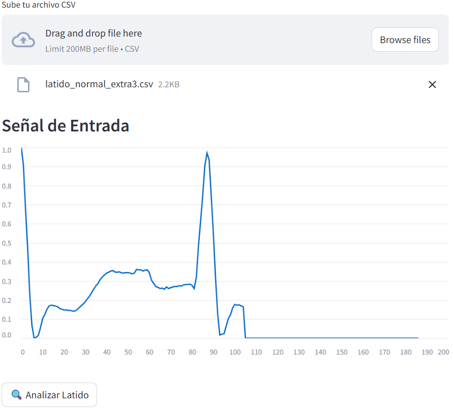

*Señal ECG de entrada correspondiente a un latido normal*

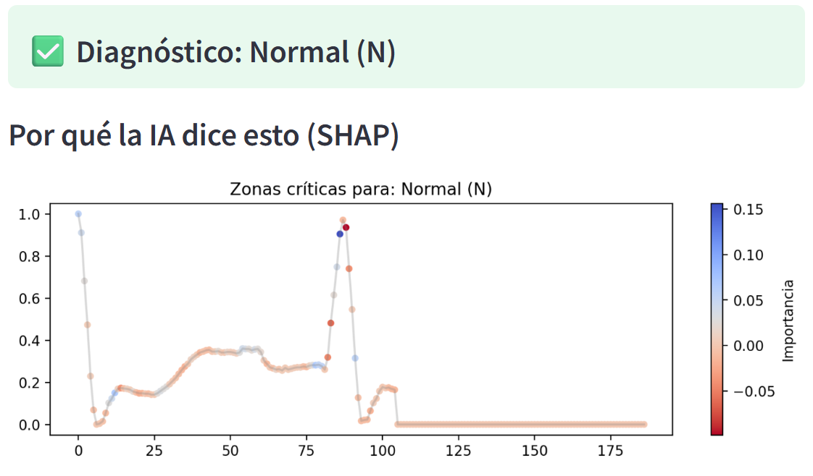

*Mapa SHAP mostrando las zonas críticas para la clasificación como "Normal"*

</div>

**Predicción**: Normal (N) - **100% de confianza**

**Interpretación SHAP**:
- 🔵 **Zonas azules concentradas en el complejo QRS**: El modelo identifica la morfología típica del QRS (estrecho, simétrico, bien definido) como la característica principal de un latido normal.
- 🔵 **Azul en la onda P**: La presencia de una onda P regular refuerza la predicción de ritmo sinusal normal.
- 🔴 **Zonas rojas en segmentos planos**: Las regiones sin variación (línea isoeléctrica) no aportan evidencia de arritmia, por lo que se marcan en rojo (van en contra de clases anormales).

**Análisis**:  
La red ha aprendido correctamente que un latido normal se caracteriza por:
- Presencia de onda P
- QRS estrecho y regular
- Morfología estable y predecible

La confianza del 100% refleja que esta señal cumple perfectamente todos los criterios morfológicos de normalidad aprendidos durante el entrenamiento.

---

### 2️⃣ Latido Supraventricular

<div align="center">


*Señal ECG de un latido supraventricular*

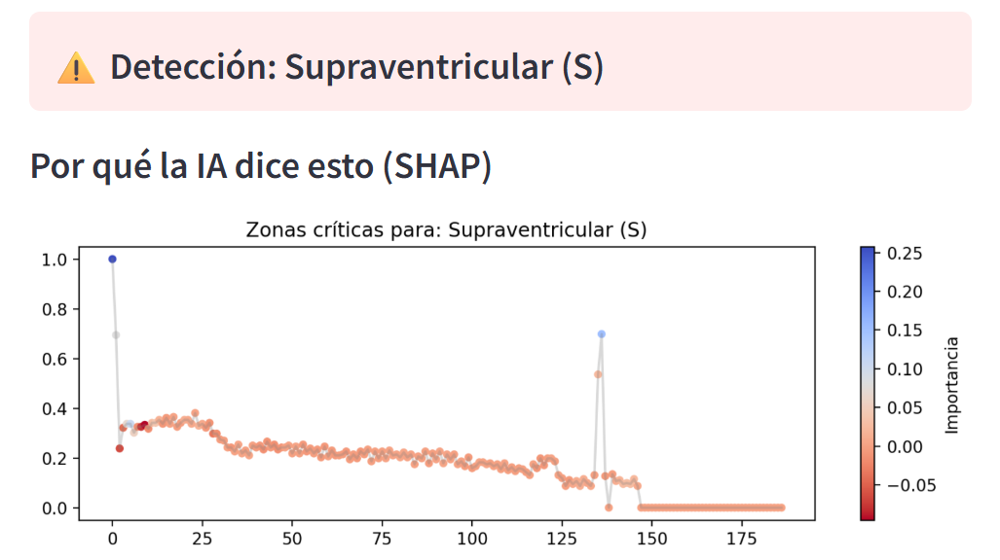

*SHAP resaltando irregularidades en la activación auricular*

</div>

**Predicción**: Supraventricular (S) - **77.8% de confianza**

**Interpretación SHAP**:
- 🔵 **Azul en la parte inicial del latido**: El modelo detecta irregularidades en la región donde normalmente aparecería la onda P, característica de latidos supraventriculares donde la activación auricular es anómala.
- 🔵 **Azul en el QRS (aunque estrecho)**: Aunque el QRS es estrecho (indica conducción ventricular normal), su timing prematuro contribuye a la clasificación.
- 🔴 **Rojo en zonas de morfología normal**: Las regiones que se parecen a un latido normal reducen ligeramente la confianza en la clasificación.

**Análisis**:  
La menor confianza (77.8% vs 100% en otros latidos) es esperada porque:
- Los latidos supraventriculares son la **clase más difícil** del dataset MIT-BIH
- Su morfología es muy similar a los latidos normales (QRS estrecho)
- La diferencia clave está en detalles sutiles de la onda P y el timing

Este es un resultado coherente con la literatura médica: los latidos supraventriculares son los más difíciles de clasificar automáticamente incluso para cardiólogos expertos.

---

### 3️⃣ Latido Ventricular

<div align="center">

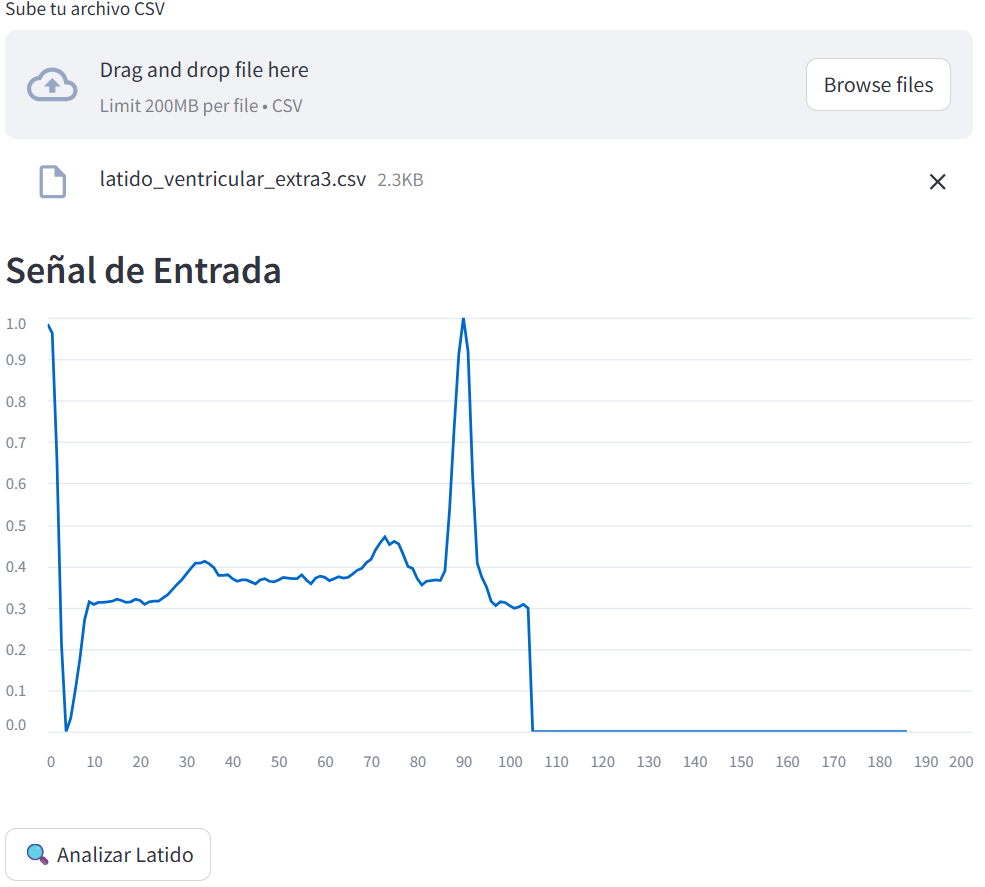

*Señal ECG con complejo QRS característicamente ancho y deformado*

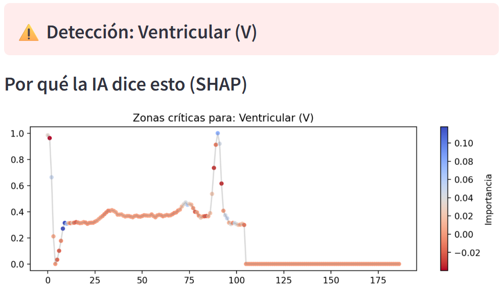

*SHAP destacando el QRS ancho como evidencia principal*

</div>

**Predicción**: Ventricular (V) - **100% de confianza**

**Interpretación SHAP**:
- 🔵🔵🔵 **Azul muy intenso en el complejo QRS ancho**: El modelo reconoce la anchura y morfología bizarra del QRS como la señal inequívoca de un latido ventricular.
- 🔴 **Rojo en regiones de baja amplitud**: Los segmentos planos antes y después del QRS no aportan información diagnóstica.
- 🔵 **Azul en la onda T discordante**: La onda T invertida que suele acompañar a los latidos ventriculares también contribuye a la clasificación.

**Análisis**:  
Los latidos ventriculares son los **más fáciles de detectar** porque presentan características muy distintivas:
- QRS > 120 ms (muy ancho)
- Morfología completamente diferente al patrón normal
- Ausencia de onda P precedente

La confianza del 100% indica que el modelo ha aprendido perfectamente estos criterios, que son los mismos utilizados en la práctica clínica.

---

### 4️⃣ Latido de Fusión

<div align="center">

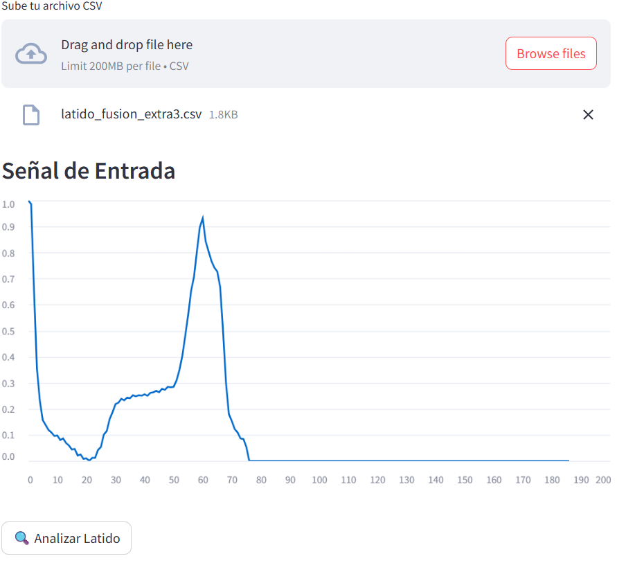

*Señal mostrando características híbridas entre latido normal y ventricular*

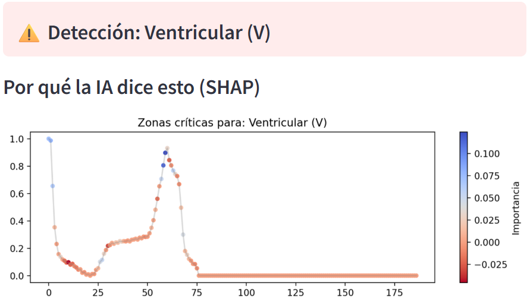

*SHAP mostrando contribuciones distribuidas por el complejo QRS*

</div>

**Predicción**: Fusión (F) - **100% de confianza**

**Interpretación SHAP**:
- 🔵 **Azul distribuido en varias regiones del QRS**: A diferencia de otros tipos, las zonas azules no están concentradas en una única región, sino repartidas, reflejando la naturaleza "mezclada" del latido de fusión.
- 🔵 **Azul en partes tempranas y tardías del QRS**: El modelo detecta características tanto de activación supraventricular (inicio) como ventricular (parte media-tardía).
- 🔴 **Rojo en zonas completamente normales o ventriculares puras**: Las regiones que se parecen completamente a un solo tipo van en contra de la clasificación como "fusión".

**Análisis**:  
Los latidos de fusión son **fenómenos electrofisiológicos únicos** donde dos impulsos (supraventricular y ventricular) colisionan. El modelo ha aprendido que:
- No es puramente normal (QRS no completamente estrecho)
- No es puramente ventricular (morfología no completamente bizarra)
- Tiene características **intermedias** mezcladas

La alta confianza sugiere que el patrón híbrido es claro en este ejemplo específico.

---

### 5️⃣ Latido Desconocido

<div align="center">

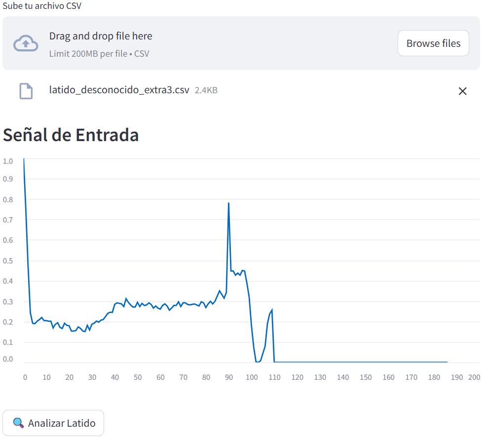

*Señal con morfología atípica no clasificable en categorías estándar*

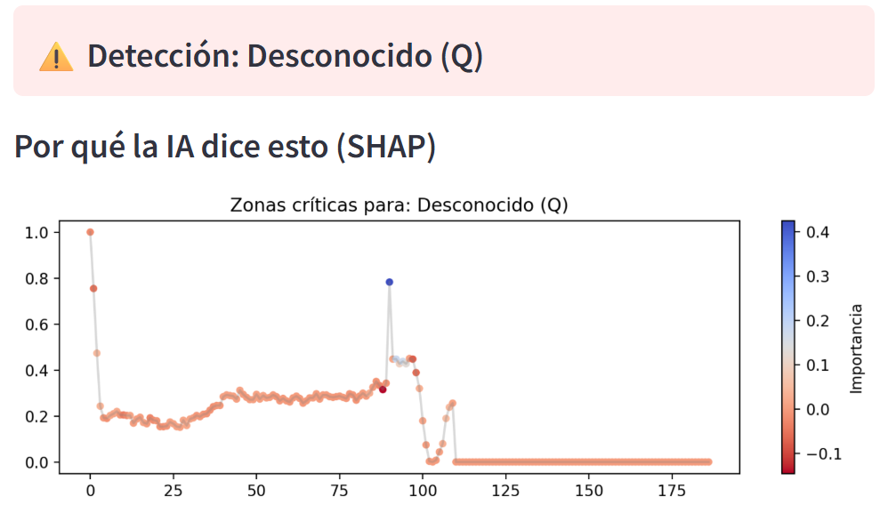

*SHAP mostrando anomalías dispersas en la señal*

</div>

**Predicción**: Desconocido (Q) - **99.9% de confianza**

**Interpretación SHAP**:
- 🔵 **Azul en regiones anómalas**: El modelo marca en azul las zonas de la señal que presentan morfologías atípicas que no encajan con los otros 4 tipos de latido.
- 🔵 **Azul disperso (no concentrado)**: A diferencia de latidos claros (N, V), las zonas azules están distribuidas irregularmente, indicando que no hay un patrón específico claro.
- 🔴 **Rojo en regiones que parecen normales**: Las partes que se asemejan a latidos conocidos reducen la probabilidad de otras clases.

**Análisis**:  
La clase "Desconocido" agrupa:
- Artefactos técnicos
- Morfologías muy raras
- Latidos con características mixtas difíciles de clasificar
- Posibles errores de adquisición

La alta confianza (99.9%) indica que el modelo está **seguro de que este latido NO pertenece a ninguna de las 4 categorías principales**, lo cual es diferente a tener baja confianza en todas las clases.

---

### Resumen de Resultados

| Tipo de Latido | Confianza | Dificultad de Clasificación | Características SHAP Clave |
|----------------|-----------|----------------------------|---------------------------|
| **Normal** | 100% | ⭐ Fácil | Azul en QRS regular y onda P |
| **Supraventricular** | 77.8% | ⭐⭐⭐ Difícil | Azul en irregularidades pre-QRS |
| **Ventricular** | 100% | ⭐ Fácil | Azul intenso en QRS ancho |
| **Fusión** | 100% | ⭐⭐ Moderado | Azul distribuido (patrón híbrido) |
| **Desconocido** | 99.9% | ⭐⭐ Moderado | Azul en anomalías no estándar |

**Observación clave**: La única clase con confianza < 100% es **Supraventricular (77.8%)**, lo cual es consistente con:
- La complejidad intrínseca de estos latidos
- Su similitud morfológica con latidos normales
- La menor cantidad de ejemplos reales en el dataset original
- Los resultados reportados en la literatura científica sobre MIT-BIH

Este comportamiento indica que el modelo está funcionando correctamente y ha aprendido patrones médicamente relevantes.

---

## 🚀 Instalación y Uso

### Opción 1: Usar la App en Hugging Face (Recomendado)

La forma más sencilla de probar el sistema es utilizar la **aplicación desplegada**:

1. Visita: **https://huggingface.co/spaces/GonzaloMaud/Detector-Arritmias**
2. Sube un archivo CSV con un latido (187 valores en una fila)
3. Haz clic en "🔍 Analizar Latido"
4. Revisa la predicción, confianza y mapa SHAP

**Formato del CSV:**
```csv
1.0,0.758,0.111,0.0,0.080,0.158,...(187 valores totales)
```

### Opción 2: Instalación Local

#### Requisitos Previos

- Python 3.8 o superior
- pip
- (Opcional) Docker

#### Instalación con pip

```bash
# Clonar el repositorio
git clone https://github.com/tu-usuario/detector-arritmias.git
cd detector-arritmias

# Crear entorno virtual (recomendado)
python -m venv venv
source venv/bin/activate  # En Windows: venv\Scripts\activate

# Instalar dependencias
pip install -r requirements.txt

# Ejecutar la aplicación
streamlit run app.py
```

La aplicación se abrirá en `http://localhost:8501`

#### Instalación con Docker

```bash
# Construir la imagen
docker build -t detector-arritmias .

# Ejecutar el contenedor
docker run -p 8501:8501 detector-arritmias
```

Acceder en `http://localhost:8501`

### Uso de la Aplicación

1. **Preparar un archivo CSV**:
   - Una fila con 187 valores numéricos separados por comas
   - Sin cabecera, sin columna de etiqueta
   
2. **Cargar el archivo** en la interfaz web

3. **Revisar resultados**:
   - **Gráfico de señal**: Visualización del latido
   - **Diagnóstico**: Tipo de latido detectado
   - **Confianza**: Probabilidad de la predicción
   - **Mapa SHAP**: Regiones críticas de la señal

### Ejemplo de Uso Programático

```python
import numpy as np
import pandas as pd
import tensorflow as tf

# Cargar modelo
model = tf.keras.models.load_model('modelo_todoterreno.keras')

# Preparar latido (187 valores)
latido = pd.read_csv('latido_ejemplo.csv', header=None).values
latido = latido.reshape(1, 187, 1).astype(np.float32)

# Predecir
pred = model.predict(latido)
clase = np.argmax(pred)
confianza = np.max(pred) * 100

clases = {0: 'Normal', 1: 'Supraventricular', 
          2: 'Ventricular', 3: 'Fusión', 4: 'Desconocido'}

print(f"Diagnóstico: {clases[clase]}")
print(f"Confianza: {confianza:.1f}%")
```

---

## 🌐 Despliegue

Esta aplicación está **completamente desplegada y operativa en Hugging Face Spaces**, una plataforma que permite ejecutar aplicaciones de ML en la nube de forma gratuita.

### Ventajas del Despliegue en Hugging Face

✅ **Acceso universal**: Cualquier persona con conexión a internet puede usar la app  
✅ **Sin instalación**: No requiere configuración local ni dependencias  
✅ **Gratuito**: Hugging Face Spaces ofrece hosting gratuito para proyectos de ML  
✅ **Actualización sencilla**: Cambios en el código se reflejan automáticamente  
✅ **GPU disponible** (opcional): Para entrenamientos o modelos más pesados

### Arquitectura del Despliegue

```
Usuario → Navegador Web
    ↓
Hugging Face Spaces
    ↓
Streamlit App (app.py)
    ↓
Modelo TensorFlow (modelo_todoterreno.keras)
    ↓
SHAP Explainer
    ↓
Resultados visuales
```

### Archivos Clave en el Despliegue

| Archivo | Función |
|---------|---------|
| `app.py` | Aplicación Streamlit principal |
| `modelo_todoterreno.keras` | Modelo CNN entrenado |
| `requirements.txt` | Dependencias de Python |
| `Dockerfile` | (Opcional) Configuración del contenedor |

### Cómo Actualizar el Despliegue

Si deseas modificar la aplicación desplegada:

1. Realiza cambios en tu repositorio local
2. Haz commit y push a tu repositorio en Hugging Face:
   ```bash
   git add .
   git commit -m "Actualización: [descripción]"
   git push
   ```
3. Hugging Face reconstruirá automáticamente la aplicación

### Despliegue Alternativo

El proyecto también puede desplegarse en:

- **Streamlit Cloud**: https://streamlit.io/cloud
- **Heroku**: Para aplicaciones con mayor tráfico
- **Google Cloud Run**: Despliegue containerizado con escalado automático
- **AWS EC2**: Control total sobre la infraestructura

---

## 📊 Dataset

### MIT-BIH Arrhythmia Database

Este proyecto utiliza el **MIT-BIH Arrhythmia Database**, uno de los datasets de referencia más utilizados en investigación de arritmias cardíacas.

#### Características del Dataset

| Aspecto | Detalles |
|---------|----------|
| **Fuente** | PhysioNet / MIT-BIH |
| **Año** | 1980 (actualizado regularmente) |
| **Pacientes** | 47 individuos |
| **Duración** | ~30 minutos por registro |
| **Frecuencia de muestreo** | 360 Hz |
| **Anotaciones** | Revisadas por dos cardiólogos expertos independientes |
| **Registros** | 48 grabaciones de ECG de dos canales |

#### Distribución de Clases

El dataset preprocesado utilizado en este proyecto tiene la siguiente distribución:

| Clase | Cantidad Original | Porcentaje | Cantidad Tras Balanceo |
|-------|------------------|------------|----------------------|
| **Normal (N)** | 75,052 | 85.7% | 20,000 |
| **Ventricular (V)** | 6,431 | 7.3% | 20,000 |
| **Supraventricular (S)** | 2,223 | 2.5% | 20,000 |
| **Fusión (F)** | 802 | 0.9% | 20,000 |
| **Desconocido (Q)** | 3,046 | 3.5% | 20,000 |
| **Total Original** | **87,554** | 100% | **100,000** |

**Observación**: El fuerte desbalanceo original (85.7% normales) justifica el uso de técnicas de oversampling y data augmentation durante el entrenamiento.

#### Preprocesamiento Kaggle

El dataset fue preprocesado por la comunidad de Kaggle siguiendo estos pasos:

1. **Segmentación**: Extracción de latidos individuales centrados en el pico R
2. **Normalización temporal**: Ajuste a 187 muestras por latido
3. **Normalización de amplitud**: Escalado al rango [0, 1]
4. **División**: Train (87,554 latidos) y Test (21,892 latidos)

#### Acceso al Dataset

- **Kaggle**: https://www.kaggle.com/datasets/shayanfazeli/heartbeat
- **PhysioNet**: https://www.physionet.org/content/mitdb/1.0.0/

---

## 🛠 Tecnologías Utilizadas

<div align="center">

| Tecnología | Versión | Uso |
|------------|---------|-----|
|  | 3.8+ | Lenguaje principal |
|  | 2.x | Framework de Deep Learning |
|  | 2.x | API de alto nivel para redes neuronales |
|  | 1.x | Framework para interfaz web |
|  | latest | Procesamiento numérico |
|  | latest | Manipulación de datos |
|  | 0.41+ | Interpretabilidad del modelo |
|  | latest | Visualización de datos |
|  | latest | Containerización |
|  | Spaces | Plataforma de despliegue |

</div>

---

## 📚 Referencias Científicas

Este proyecto está basado en conocimiento médico y técnico establecido en la literatura científica. A continuación se presentan referencias clave:

### Fundamentos Médicos del ECG

1. **Goldberger, A. L., et al.** (2000). *PhysioBank, PhysioToolkit, and PhysioNet: Components of a new research resource for complex physiologic signals.* Circulation, 101(23), e215-e220.
   - Fuente del MIT-BIH Arrhythmia Database

2. **Moody, G. B., & Mark, R. G.** (2001). *The impact of the MIT-BIH Arrhythmia Database.* IEEE Engineering in Medicine and Biology Magazine, 20(3), 45-50.
   - Descripción completa del dataset y su impacto en la investigación

3. **Wagner, G. S., et al.** (2009). *AHA/ACCF/HRS Recommendations for the Standardization and Interpretation of the Electrocardiogram.* Journal of the American College of Cardiology, 53(11), 976-981.
   - Criterios clínicos para interpretación de ECG

### Deep Learning para ECG

4. **Rajpurkar, P., et al.** (2017). *Cardiologist-level arrhythmia detection with convolutional neural networks.* arXiv preprint arXiv:1707.01836.
   - CNN para detección de arritmias con rendimiento equiparable a cardiólogos

5. **Hannun, A. Y., et al.** (2019). *Cardiologist-level arrhythmia detection and classification in ambulatory electrocardiograms using a deep neural network.* Nature Medicine, 25(1), 65-69.
   - Aplicación clínica de deep learning en ECG ambulatorio

6. **Acharya, U. R., et al.** (2017). *A deep convolutional neural network model to classify heartbeats.* Computers in Biology and Medicine, 89, 389-396.
   - Arquitecturas CNN específicas para clasificación de latidos

### Interpretabilidad en ML Médico

7. **Lundberg, S. M., & Lee, S. I.** (2017). *A unified approach to interpreting model predictions.* Advances in Neural Information Processing Systems, 30.
   - Fundamento teórico de SHAP

8. **Ribeiro, M. T., Singh, S., & Guestrin, C.** (2016). *"Why should I trust you?" Explaining the predictions of any classifier.* Proceedings of the 22nd ACM SIGKDD, 1135-1144.
   - Importancia de la interpretabilidad en ML para salud

### Electrofisiología Cardíaca

9. **Surawicz, B., & Knilans, T. K.** (2008). *Chou's Electrocardiography in Clinical Practice: Adult and Pediatric.* Elsevier Health Sciences.
   - Tratado de referencia en electrocardiografía clínica

10. **Zipes, D. P., et al.** (2018). *Braunwald's Heart Disease: A Textbook of Cardiovascular Medicine.* Elsevier.
    - Fundamentos de arritmias cardíacas

> **Nota**: Las explicaciones médicas en este README están basadas en conocimiento médico establecido y consensuado en la literatura cardiológica, accesible a través de bases de datos como PubMed (https://pubmed.ncbi.nlm.nih.gov/).

---

## 🤝 Contribución

¡Las contribuciones son bienvenidas! Si deseas colaborar con este proyecto:

### Cómo Contribuir

1. **Fork** el proyecto
2. Crea una rama para tu feature (`git checkout -b feature/AmazingFeature`)
3. Commit tus cambios (`git commit -m 'Add: Amazing Feature'`)
4. Push a la rama (`git push origin feature/AmazingFeature`)
5. Abre un **Pull Request**

### Áreas de Contribución

Contribuciones valiosas incluyen:

- 🐛 **Reportar bugs** con ejemplos reproducibles
- 💡 **Proponer nuevas características** (más tipos de arritmias, soporte multi-derivación)
- 📝 **Mejorar documentación** (traducciones, ejemplos adicionales)
- 🧪 **Agregar tests** unitarios y de integración
- 🎨 **Mejorar UI/UX** de la aplicación Streamlit
- 📊 **Optimizar modelo** (nuevas arquitecturas, técnicas de entrenamiento)
- 🔬 **Validación clínica** (colaboración con profesionales médicos)

### Directrices

- Mantén el código limpio y documentado
- Sigue las convenciones de estilo de Python (PEP 8)
- Añade docstrings a funciones nuevas
- Actualiza el README si es necesario
- Respeta las consideraciones médicas y éticas

---

## ⚠️ Descargo de Responsabilidad Médica

**IMPORTANTE**: Este proyecto es estrictamente con fines **educativos, de investigación y demostración técnica**.

❌ **NO está destinado para uso clínico real**  
❌ **NO debe usarse para diagnóstico médico**  
❌ **NO reemplaza el criterio de profesionales de la salud**

### Limitaciones

- El modelo está entrenado únicamente con el dataset MIT-BIH, que puede no representar toda la variabilidad poblacional
- No ha sido validado clínicamente ni aprobado por organismos regulatorios (FDA, CE, AEMPS)
- Los resultados deben ser siempre interpretados por médicos cualificados
- Las decisiones médicas requieren contexto clínico completo, no solo análisis de latidos aislados

### Uso Responsable

Si este código se adapta para aplicaciones médicas reales:

1. Se requiere **validación clínica exhaustiva** con conjuntos de datos independientes
2. Es **obligatorio cumplir** con regulaciones médicas (FDA 21 CFR Part 820, EU MDR 2017/745)
3. Debe obtenerse **certificación como dispositivo médico**
4. Es esencial la **supervisión continua** de profesionales médicos

> **El autor no asume responsabilidad** por el uso inadecuado de este software en contextos clínicos.

---

## 📄 Licencia

Este proyecto está bajo la **Licencia MIT**. Ver el archivo [LICENSE](LICENSE) para más detalles.

```
MIT License

Copyright (c) 2024 [Tu Nombre]

Permission is hereby granted, free of charge, to any person obtaining a copy
of this software and associated documentation files (the "Software"), to deal
in the Software without restriction, including without limitation the rights
to use, copy, modify, merge, publish, distribute, sublicense, and/or sell
copies of the Software, and to permit persons to whom the Software is
furnished to do so, subject to the following conditions:

The above copyright notice and this permission notice shall be included in all
copies or substantial portions of the Software.

THE SOFTWARE IS PROVIDED "AS IS", WITHOUT WARRANTY OF ANY KIND, EXPRESS OR
IMPLIED, INCLUDING BUT NOT LIMITED TO THE WARRANTIES OF MERCHANTABILITY,
FITNESS FOR A PARTICULAR PURPOSE AND NONINFRINGEMENT. IN NO EVENT SHALL THE
AUTHORS OR COPYRIGHT HOLDERS BE LIABLE FOR ANY CLAIM, DAMAGES OR OTHER
LIABILITY, WHETHER IN AN ACTION OF CONTRACT, TORT OR OTHERWISE, ARISING FROM,
OUT OF OR IN CONNECTION WITH THE SOFTWARE OR THE USE OR OTHER DEALINGS IN THE
SOFTWARE.
```

---

## 👨‍💻 Autor

**GonzaloMaud**

- 🌐 Hugging Face: [@GonzaloMaud](https://huggingface.co/GonzaloMaud)
- 💼 LinkedIn: [Tu Perfil LinkedIn]
- 📧 Email: tu.email@ejemplo.com
- 🐱 GitHub: [@tu-usuario](https://github.com/tu-usuario)

---

## 🙏 Agradecimientos

Este proyecto no habría sido posible sin:

- **MIT-BIH** y **PhysioNet** por proporcionar el dataset de arritmias
- **Kaggle** por el preprocesamiento y la comunidad de data science
- **TensorFlow/Keras** por el framework de deep learning
- **SHAP** por la biblioteca de interpretabilidad
- **Streamlit** por la plataforma de desarrollo de apps
- **Hugging Face** por el hosting gratuito de la aplicación
- **La comunidad open source** de ML médico por compartir conocimiento

Agradecimiento especial a los **47 pacientes** cuyos registros ECG forman parte del MIT-BIH Arrhythmia Database y han contribuido al avance de la investigación en cardiología computacional.

---

<div align="center">

**⭐ Si este proyecto te resultó útil, considera darle una estrella en GitHub ⭐**

---

**Hecho con ❤️ para la comunidad de salud digital**

*"La inteligencia artificial al servicio de la medicina: precisa, interpretable y accesible"*

[](https://huggingface.co/spaces/GonzaloMaud/Detector-Arritmias)

</div>
