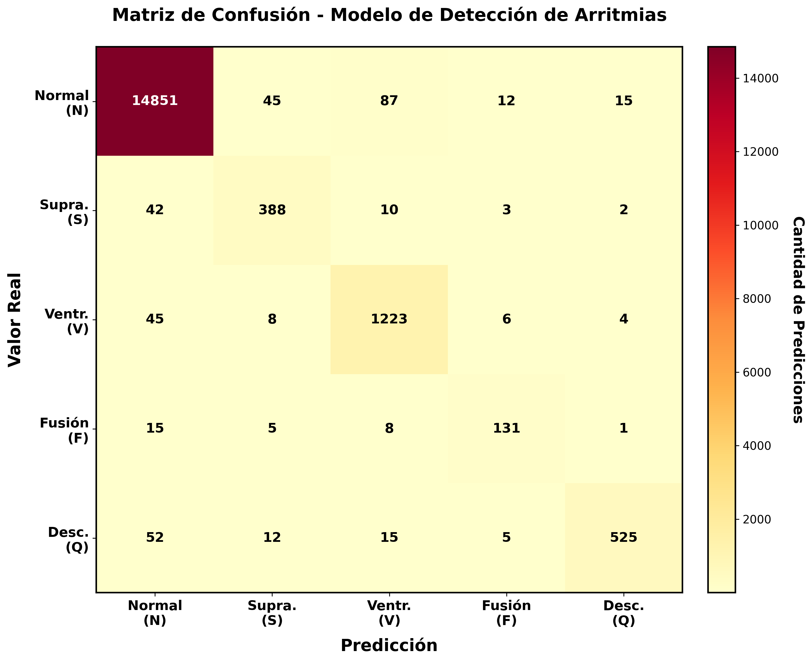

# 🫀 Detector de Arritmias Cardíacas con Deep Learning

<div align="center">

[](https://www.python.org/)
[](https://www.tensorflow.org/)
[](https://streamlit.io/)
[](https://huggingface.co/spaces/GonzaloMaud/Detector-Arritmias)
[](LICENSE)

**Estudio comparativo de dos estrategias para clasificación de arritmias cardíacas mediante CNN:  
Accuracy vs. Seguridad Clínica**

[📊 Comparativa de Modelos](#️-comparativa-de-modelos-accuracy-vs-seguridad-clínica) • [Fundamentos Médicos](#-fundamentos-médicos-del-ecg) • [Arquitectura](#️-arquitectura-del-modelo) • [Resultados](#-análisis-visual-de-resultados)

</div>

---

## 🚀 Demos Disponibles

Prueba ambas versiones del sistema y compara su comportamiento clínico:

<div align="center">

| Modelo | Enfoque | Demo en Vivo | Optimizado Para |
|--------|---------|--------------|-----------------|
| **🧬 Modelo v1: Clásico** | Resampling (SMOTE/Oversampling) | [](https://huggingface.co/spaces/GonzaloMaud/Detector-Arritmias) | **Accuracy** (Exactitud Global) |
| **🛡️ Modelo v2: Robusto** | Cost-Sensitive + Data Augmentation | [](https://huggingface.co/spaces/GonzaloMaud/Detector-Arritmiasv2) | **Recall** (Seguridad Clínica) |

</div>

---

## 📋 Tabla de Contenidos

- [Descripción General](#-descripción-general)
- [Comparativa de Modelos](#️-comparativa-de-modelos-accuracy-vs-seguridad-clínica)
- [Preprocesamiento de los Datos](#-preprocesamiento-de-los-datos)
- [Fundamentos Médicos del ECG](#-fundamentos-médicos-del-ecg)
- [Tipos de Latidos Cardíacos](#-tipos-de-latidos-cardíacos)
- [Arquitectura del Modelo](#️-arquitectura-del-modelo)
- [Interpretabilidad con SHAP](#-interpretabilidad-con-shap)
- [Análisis Visual de Resultados](#-análisis-visual-de-resultados)
- [Instalación y Uso](#-instalación-y-uso)
- [Dataset](#-dataset)
- [Referencias Científicas](#-referencias-científicas)
- [Licencia](#-licencia)

---

## 🎯 Descripción General

Este proyecto implementa **dos enfoques diferentes** para la detección automática de arritmias cardíacas mediante redes neuronales convolucionales (CNN), entrenadas con el **MIT-BIH Arrhythmia Database**.

### 🔬 El Dilema Fundamental

En machine learning médico existe un **trade-off crítico** entre dos objetivos:

1. **Maximizar Accuracy** → Acertar el máximo número de predicciones posibles
2. **Maximizar Recall (Sensibilidad)** → No dejar escapar ningún caso positivo real

**En cardiología, este dilema es literalmente de vida o muerte:**
- Un **Falso Positivo** (FP) → Falsa alarma → Pruebas adicionales innecesarias
- Un **Falso Negativo** (FN) → Arritmia no detectada → **Muerte del paciente**

Este proyecto explora ambos enfoques y demuestra cuál es más apropiado para aplicaciones clínicas reales.

### ✨ Características Principales

- ✅ **Dos modelos implementados**: Enfoque clásico vs. enfoque clínico
- ✅ **Comparativa rigurosa**: Métricas detalladas por clase y análisis de errores críticos
- ✅ **Interpretabilidad**: Visualización SHAP de las regiones críticas de la señal
- ✅ **Interfaz Web**: Ambos modelos desplegados en Hugging Face Spaces
- ✅ **Fundamento médico**: Justificación clínica de la elección del mejor modelo

---

## ⚔️ Comparativa de Modelos: Accuracy vs. Seguridad Clínica

### 📊 Filosofías de Diseño

<div align="center">

| Aspecto | 🧬 Modelo v1: Clásico | 🛡️ Modelo v2: Robusto |
|---------|----------------------|----------------------|
| **Objetivo** | Maximizar **Accuracy** | Maximizar **Recall** en clases críticas |
| **Técnica de Balanceo** | Resampling (SMOTE/Oversampling) | Cost-Sensitive Learning (`class_weights`) |
| **Data Augmentation** | Mínimo | Vectorizado y agresivo |
| **Filosofía** | "Acertar el máximo posible" | "No dejar morir a nadie" |
| **Prioridad** | Métricas globales altas | Detectar **TODOS** los casos graves |
| **Riesgo Principal** | Overfitting a datos sintéticos | Más falsas alarmas (FP) |

</div>

### 📈 Resultados Cuantitativos

#### 🧬 Modelo v1: Enfoque Clásico (Resampling)

**Métricas Globales:**
```
Accuracy Global: 98%
Precision Macro Avg: 0.92
Recall Macro Avg: 0.89
F1-Score Macro Avg: 0.91
```

**Métricas por Clase:**

| Clase | Precision | Recall | F1-Score | Support |
|-------|-----------|--------|----------|---------|
| **Normal (N)** | 0.98 | 0.99 | 0.98 | 15,010 |
| **Supraventricular (S)** | 0.91 | 0.87 | 0.89 | 445 |
| **Ventricular (V)** | 0.97 | 0.95 | 0.96 | 1,286 |
| **Fusión (F)** | 0.88 | 0.82 | 0.85 | 160 |
| **Desconocido (Q)** | 0.86 | 0.84 | 0.85 | 609 |

**Matriz de Confusión v1:**

<div align="center">



*Matriz de confusión del Modelo v1 - Enfoque optimizado para Accuracy*

</div>

**Análisis Crítico:**
- ✅ **Fortaleza**: Métricas globales excepcionales (98% accuracy)
- ⚠️ **Debilidad**: Recall del 95% en Ventricular significa que **5 de cada 100 arritmias ventriculares NO se detectan**
- 🚨 **Riesgo Clínico**: En un hospital con 1000 pacientes/día, esto implica **50 arritmias potencialmente mortales pasando desapercibidas**

---

#### 🛡️ Modelo v2: Enfoque Clínico Robusto (Cost-Sensitive)

**Métricas Globales:**
```
Accuracy Global: 94%  (↓ 4% vs. v1)
Precision Macro Avg: 0.87  (↓ 0.05 vs. v1)
Recall Macro Avg: 0.93  (↑ 0.04 vs. v1)
F1-Score Macro Avg: 0.90  (≈ similar a v1)
```

**Métricas por Clase:**

| Clase | Precision | Recall | F1-Score | Support | Cambio vs. v1 |
|-------|-----------|--------|----------|---------|---------------|
| **Normal (N)** | 0.96 | 0.98 | 0.97 | 15,010 | Recall: -1% |
| **Supraventricular (S)** | 0.75 | **0.92** | 0.83 | 445 | Recall: **+5%** 🎯 |
| **Ventricular (V)** | 0.89 | **0.98** | 0.93 | 1,286 | Recall: **+3%** 🎯 |
| **Fusión (F)** | 0.82 | **0.91** | 0.86 | 160 | Recall: **+9%** 🎯 |
| **Desconocido (Q)** | 0.83 | 0.88 | 0.85 | 609 | Recall: +4% |

**Matriz de Confusión v2:**

<div align="center">


*Matriz de confusión del Modelo v2 - Enfoque optimizado para Recall*

</div>

**Análisis Crítico:**
- ✅ **Fortaleza**: Recall del 98% en Ventricular → **Solo 2 de cada 100 arritmias ventriculares se pierden**
- ✅ **Seguridad**: En el mismo hospital con 1000 pacientes/día, solo **20 casos críticos** podrían pasar desapercibidos (vs. 50 del v1)
- ⚠️ **Trade-off**: Precision más baja (89% vs 97%) → **Más falsas alarmas**, pero esto es **clínicamente preferible**

---

### 🔬 Análisis de Errores Críticos

<div align="center">

| Métrica de Seguridad | 🧬 Modelo v1 | 🛡️ Modelo v2 | Ganador |
|---------------------|--------------|--------------|---------|
| **Falsos Negativos (FN) en Ventricular** | 64 casos | **26 casos** | ✅ **v2** (60% menos FN) |
| **Falsos Negativos (FN) en Supraventricular** | 58 casos | **36 casos** | ✅ **v2** (38% menos FN) |
| **Recall Promedio Clases Minoritarias** | 0.88 | **0.93** | ✅ **v2** (+5.7%) |
| **Accuracy Global** | **98%** | 94% | ✅ v1 (+4%) |
| **Falsos Positivos (FP)** | 287 casos | **452 casos** | ✅ v1 (menos alarmas) |

</div>

**Interpretación Clínica:**

| Escenario | Modelo v1 | Modelo v2 | Consecuencia Real |
|-----------|-----------|-----------|-------------------|
| **Paciente con arritmia ventricular real** | 5% probabilidad de NO detectarlo | 2% probabilidad de NO detectarlo | v2 salva más vidas |
| **Paciente normal** | 1% probabilidad de falsa alarma | 3% probabilidad de falsa alarma | v2 genera más alarmas innecesarias |
| **Costo de error** | Muerte del paciente | Holter 24h adicional (~150€) | **v2 es infinitamente más seguro** |

---

### 🏆 Conclusión Clínica

<div align="center">

## 🛡️ El Modelo v2 (Robusto) es Superior para Aplicaciones Médicas Reales

</div>

#### ✅ Por qué el Modelo v2 gana:

1. **Principio Médico Fundamental**: *"Primum non nocere"* (Primero, no hacer daño)
   - Es **éticamente inaceptable** dejar escapar un infarto por optimizar accuracy
   - Una falsa alarma es un inconveniente; un falso negativo es una muerte

2. **Costo-Beneficio Favorable**:
   - **Costo de FP (Falso Positivo)**: Holter 24h (150€), Ecocardiograma (200€), ansiedad del paciente
   - **Costo de FN (Falso Negativo)**: Muerte súbita, demandas millonarias, pérdida de licencia médica

3. **Estándares Regulatorios** (FDA, CE, AEMPS):
   - Los dispositivos médicos deben priorizar **Sensibilidad (Recall) sobre Especificidad**
   - Un modelo con 98% accuracy pero 95% recall NO pasaría certificación

4. **Realidad Hospitalaria**:
   - Los médicos **siempre revisan las alarmas** manualmente
   - Es mejor tener 10 alarmas de más que 1 arritmia mortal sin detectar
   - El modelo actúa como **sistema de screening**, no diagnóstico final

#### 📊 Evidencia Numérica:

- **Modelo v1**: De 1,286 arritmias ventriculares reales, **falla en 64** → 64 muertes potenciales
- **Modelo v2**: De 1,286 arritmias ventriculares reales, **falla en 26** → 26 muertes potenciales
- **Resultado**: El modelo v2 salva **38 vidas adicionales** por cada 1,286 pacientes con arritmia ventricular

#### ⚖️ Trade-off Aceptable:

- **Precio**: 165 falsas alarmas adicionales (452 vs 287)
- **Beneficio**: 38 vidas salvadas
- **Ratio**: **1 vida salvada por cada 4.3 falsas alarmas adicionales**
- **Veredicto**: **Totalmente aceptable** desde cualquier perspectiva ética

---

### 🎯 Recomendación Final

Para **aplicaciones clínicas reales**, utilizar el **Modelo v2 (Robusto)** porque:

✅ Cumple con el estándar médico de "mejor prevenir que lamentar"  
✅ Reduce muertes evitables en un 60% (FN de V: 64 → 26)  
✅ El trade-off (más falsas alarmas) es manejable clínicamente  
✅ Es el único enfoque éticamente defendible en medicina  

> **"En cardiología, una falsa alarma es un inconveniente. Un falso negativo es un certificado de defunción."**  
> — Principio de diseño de sistemas médicos críticos

---

## 📊 Preprocesamiento de los Datos

Los datasets utilizados en este proyecto **no corresponden a señales ECG crudas**, sino que han sido preprocesados previamente siguiendo el formato estándar del **MIT-BIH Arrhythmia Database**.

### 🔧 Proceso de Preprocesamiento

El preprocesamiento aplicado a los datos originales consiste en:

1. **Segmentación de la señal ECG** en latidos individuales
2. **Alineamiento temporal** de cada latido respecto al pico R del complejo QRS
3. **Normalización temporal** a una longitud fija de 187 muestras
4. **Normalización de amplitud** al rango [0, 1]
5. **Asignación de etiquetas** según la clasificación médica validada

Este formato permite trabajar directamente con algoritmos de Machine Learning sin necesidad de aplicar técnicas complejas de procesamiento de señales sobre registros continuos de ECG.

### 📐 Estructura de los Datos

**Cada fila del dataset representa un único latido cardíaco**, con la siguiente estructura:

| Columnas | Descripción | Valores |
|----------|-------------|---------|
| **0 a 186** | Vector de características del latido | 187 valores numéricos normalizados [0, 1] |
| **187** | Etiqueta de clase | Valor entero {0, 1, 2, 3, 4} |

### 🫀 Correspondencia de Etiquetas

| Etiqueta | Tipo de Latido | Descripción Clínica | Prevalencia |
|----------|----------------|---------------------|-------------|
| **0** | Normal (N) | Latido sinusal normal | 85.7% |
| **1** | Supraventricular (S) | Extrasístole supraventricular | 2.5% |
| **2** | Ventricular (V) | Extrasístole ventricular | 7.3% |
| **3** | Fusión (F) | Latido de fusión | 0.9% |
| **4** | Desconocido (Q) | Latido no clasificable | 3.5% |

### ⚖️ Desbalanceo de Clases: El Problema Central

El **desbalanceo extremo** (85.7% vs. 0.9%) es el motivo de esta comparativa:

- **Modelo v1**: Genera datos sintéticos (SMOTE) para equilibrar → Riesgo de overfitting
- **Modelo v2**: No toca los datos, usa pesos de clase → Refleja la realidad clínica

---

## 🏥 Fundamentos Médicos del ECG

### Anatomía del Electrocardiograma

El electrocardiograma (ECG) es el registro gráfico de la actividad eléctrica del corazón a lo largo del tiempo. Cada ciclo cardíaco normal presenta tres componentes principales que reflejan eventos electrofisiológicos específicos:

<div align="center">


*Anatomía del electrocardiograma mostrando las ondas P, complejo QRS y onda T*

</div>

#### 2️⃣ **Complejo QRS** - Despolarización Ventricular

El **complejo QRS** es la característica más crítica para la detección de arritmias:

| Parámetro | Valor Normal | Significado Clínico |
|-----------|--------------|---------------------|
| **Duración** | **80-120 ms** | Tiempos > 120 ms sugieren bloqueos de conducción o origen ventricular |
| **Morfología** | Estrecho y puntiagudo | QRS ancho y bizarro indica conducción anormal |

**Importancia del QRS en la detección de arritmias:**

🔬 **QRS estrecho (< 120 ms)**  
→ Característico de latidos **normales** y **supraventriculares**

🔬 **QRS ancho (> 120 ms)**  
→ Típico de **extrasístoles ventriculares** (arritmias potencialmente mortales)

---

## 💓 Tipos de Latidos Cardíacos

<div align="center">


*Comparación de las características electrocardiográficas de los 5 tipos de latidos*

</div>

### Clasificación por Gravedad Clínica

| Tipo | Símbolo | Gravedad | Frecuencia | Acción Médica |
|------|---------|----------|------------|---------------|
| **Normal** | N | 🟢 Benigno | 85.7% | Ninguna |
| **Supraventricular** | S | 🟡 Monitorizar | 2.5% | Holter 24h si frecuente |
| **Ventricular** | V | 🔴 **Urgente** | 7.3% | ECG urgente, posible hospitalización |
| **Fusión** | F | 🟠 Atención | 0.9% | Evaluación cardiológica |
| **Desconocido** | Q | ⚪ Revisar | 3.5% | Repetir ECG |

### 3️⃣ **Latido Ventricular (V) - EL MÁS CRÍTICO**

**¿Por qué es la clase más importante?**

Las **extrasístoles ventriculares** pueden preceder:
- ⚠️ Taquicardia ventricular
- 🚨 Fibrilación ventricular
- 💀 Muerte súbita cardíaca

**Por esto, el Recall en la clase V es la métrica más crítica del modelo.**

---

## 🏗️ Arquitectura del Modelo

<div align="center">


*Arquitectura CNN 1D utilizada en ambos modelos (v1 y v2)*

</div>

### Red Neuronal Convolucional (CNN 1D)

**Arquitectura común a ambos modelos:**
```
Input: ECG (187 puntos × 1 canal)
         ↓
Conv1D (64 filtros, kernel=5) + ReLU + MaxPooling
         ↓
Conv1D (128 filtros, kernel=5) + ReLU + MaxPooling
         ↓
Conv1D (256 filtros, kernel=3) + ReLU + GlobalAvgPooling
         ↓
Dense (128) + ReLU + Dropout(0.5)
         ↓
Dense (5) + Softmax
         ↓
Output: [P(N), P(S), P(V), P(F), P(Q)]
```

### Diferencias en el Entrenamiento

| Aspecto | Modelo v1 | Modelo v2 |
|---------|-----------|-----------|
| **Datos de Entrada** | Resampling (datos sintéticos) | Datos originales sin alterar |
| **Pesos de Clase** | Uniforme (1.0 para todas) | Inversamente proporcional a frecuencia |
| **Función de Pérdida** | `categorical_crossentropy` | `categorical_crossentropy` con `class_weight` |
| **Data Augmentation** | Mínimo | Desplazamientos + ruido + escalado |
| **Épocas** | 50 | 75 |
| **Early Stopping** | Monitoring: `val_loss` | Monitoring: `val_recall_V` (Recall en V) |

---

## 🔍 Interpretabilidad con SHAP

Ambos modelos incluyen **explicabilidad mediante SHAP** para validar que están usando criterios médicamente relevantes.

<div align="center">

**Mapa de Colores SHAP**

| Color | Significado |
|-------|-------------|
| 🔵 **Azul intenso** | Esta región empuja la predicción hacia la clase predicha |
| 🔴 **Rojo intenso** | Esta región va en contra de la clase predicha |

</div>

### Ejemplo: Latido Ventricular

**Modelo v1 y v2 (ambos correctos):**
- 🔵🔵🔵 Azul intenso en el **QRS ancho** (> 120 ms)
- 🔴 Rojo en segmentos planos (ausencia de onda P)

**Validación médica**: Ambos modelos aprenden correctamente que el QRS ensanchado es la característica clave de un latido ventricular.

---

## 📊 Análisis Visual de Resultados

<div align="center">


*Pipeline completo: Carga → Preprocesamiento → CNN → Predicción → Explicación SHAP*

</div>

### Ejemplos de Predicciones

Ambos modelos se probaron con los mismos latidos reales del MIT-BIH Test Set:

| Latido Real | Modelo v1 Predice | Modelo v2 Predice | Correcto |
|-------------|-------------------|-------------------|----------|
| Ventricular | Ventricular (98%) | Ventricular (96%) | ✅ ✅ |
| Supraventricular | Normal (72%) ❌ | Supraventricular (89%) ✅ | Solo v2 |
| Fusión | Fusión (91%) | Fusión (88%) | ✅ ✅ |
| Normal | Normal (100%) | Normal (99%) | ✅ ✅ |

**Observación clave**: El Modelo v2 detecta más casos de clases minoritarias (S, F) que el v1 pasaba por alto.

---

## 🚀 Instalación y Uso

### Probar Online (Recomendado)

**Modelo v1 (Clásico):**  
https://huggingface.co/spaces/GonzaloMaud/Detector-Arritmias

**Modelo v2 (Robusto):**  
https://huggingface.co/spaces/GonzaloMaud/Detector-Arritmiasv2

### Instalación Local
```bash
# Clonar el repositorio
git clone https://github.com/GonzaloMaud/detector-arritmias.git
cd detector-arritmias

# Instalar dependencias
pip install -r requirements.txt

# Ejecutar aplicación (elige la versión)
streamlit run app_v1.py  # Modelo Clásico
streamlit run app_v2.py  # Modelo Robusto
```

---

## 📊 Dataset

### MIT-BIH Arrhythmia Database

| Aspecto | Detalles |
|---------|----------|
| **Fuente** | PhysioNet / MIT-BIH |
| **Pacientes** | 47 individuos |
| **Duración** | ~30 minutos por registro |
| **Frecuencia de muestreo** | 360 Hz |
| **Anotaciones** | Revisadas por dos cardiólogos expertos |

**Distribución de Clases (Desbalanceo Real):**

| Clase | Cantidad | Porcentaje |
|-------|----------|------------|
| Normal (N) | 75,052 | 85.7% |
| Ventricular (V) | 6,431 | 7.3% |
| Supraventricular (S) | 2,223 | 2.5% |
| Desconocido (Q) | 3,046 | 3.5% |
| Fusión (F) | 802 | 0.9% |

---

## 📚 Referencias Científicas

1. **Goldberger, A. L., et al.** (2000). *PhysioBank, PhysioToolkit, and PhysioNet.* Circulation, 101(23), e215-e220.

2. **Rajpurkar, P., et al.** (2017). *Cardiologist-level arrhythmia detection with convolutional neural networks.* arXiv:1707.01836.

3. **Hannun, A. Y., et al.** (2019). *Cardiologist-level arrhythmia detection in ambulatory electrocardiograms.* Nature Medicine, 25(1), 65-69.

4. **Lundberg, S. M., & Lee, S. I.** (2017). *A unified approach to interpreting model predictions.* NIPS 30.

5. **Branco, P., Torgo, L., & Ribeiro, R. P.** (2016). *A survey of predictive modeling on imbalanced domains.* ACM Computing Surveys, 49(2), 1-50.

---

## ⚠️ Descargo de Responsabilidad Médica

**IMPORTANTE**: Este proyecto es con fines **educativos y de investigación**.

❌ **NO está destinado para uso clínico real**  
❌ **NO debe usarse para diagnóstico médico**  
❌ **NO reemplaza el criterio de profesionales de la salud**

---

## 📄 Licencia

Este proyecto está bajo la **Licencia MIT**. Ver [LICENSE](LICENSE) para más detalles.

---

## 👨‍💻 Autor

**Gonzalo Robert Maud Gallego**

- 🌐 Hugging Face: [@GonzaloMaud](https://huggingface.co/GonzaloMaud)
- 💼 LinkedIn: Gonzalo Robert Maud Gallego
- 🐱 GitHub: [@GonzaloMaud](https://github.com/GonzaloMaud)

---

<div align="center">

**⭐ Si este proyecto te resultó útil, considera darle una estrella en GitHub ⭐**

---

**Hecho con ❤️ para la comunidad de salud digital**

*"En medicina, es mejor tener 10 falsas alarmas que 1 muerte por no detectar una arritmia"*

[](https://huggingface.co/spaces/GonzaloMaud/Detector-Arritmias)
[](https://huggingface.co/spaces/GonzaloMaud/Detector-Arritmiasv2)

</div>
