# 🫀 Detector de Arritmias Cardíacas con Deep Learning

<div align="center">

[](https://www.python.org/)
[](https://www.tensorflow.org/)
[](https://streamlit.io/)
[](https://huggingface.co/spaces/GonzaloMaud/Detector-Arritmias)
[](LICENSE)

**Estudio comparativo de dos estrategias para clasificación de arritmias cardíacas con CNN  
basado en el MIT-BIH Arrhythmia Database.**

[📊 Comparativa](#comparativa-de-modelos-accuracy-vs-seguridad-clínica) • [Fundamentos Médicos](#fundamentos-médicos-del-ecg) • [Arquitectura](#arquitectura-del-modelo) • [Resultados](#análisis-visual-de-resultados)

</div>

---

## 🚀 Demos Disponibles

Prueba ambas versiones del sistema y compara su comportamiento:

<div align="center">

| Modelo | Enfoque | Demo en Vivo | Optimizado para |
|--------|---------|--------------|-----------------|
| **Modelo v1: Clásico** | Resampling (SMOTE/Oversampling) | [Abrir v1](https://huggingface.co/spaces/GonzaloMaud/Detector-Arritmias) | **Accuracy global** |
| **Modelo v2: Cost-Sensitive** | `class_weight` + Data Augmentation | [Abrir v2](https://huggingface.co/spaces/GonzaloMaud/Detector-Arritmiasv2) | **Recall en clases minoritarias** |

</div>

---

## 📋 Tabla de Contenidos

- [Descripción General](#descripción-general)
- [Comparativa de Modelos](#comparativa-de-modelos-accuracy-vs-seguridad-clínica)
- [Preprocesamiento de los Datos](#preprocesamiento-de-los-datos)
- [Fundamentos Médicos del ECG](#fundamentos-médicos-del-ecg)
- [Tipos de Latidos Cardíacos](#tipos-de-latidos-cardíacos)
- [Arquitectura del Modelo](#arquitectura-del-modelo)
- [Interpretabilidad con SHAP](#interpretabilidad-con-shap)
- [Análisis Visual de Resultados](#análisis-visual-de-resultados)
- [Instalación y Uso](#instalación-y-uso)
- [Dataset](#dataset)
- [Referencias Científicas](#referencias-científicas)
- [Descargo de Responsabilidad Médica](#descargo-de-responsabilidad-médica)
- [Licencia](#licencia)
- [Autor](#autor)

---

## 📄 Descripción General

Este proyecto implementa **dos enfoques diferentes** para la detección automática de arritmias cardíacas mediante **redes neuronales convolucionales 1D (CNN)**, entrenadas y evaluadas sobre el **MIT-BIH Arrhythmia Database**.

### El Dilema Fundamental

En machine learning aplicado a medicina aparece un **trade-off** entre:

1. **Maximizar accuracy** → acertar el máximo número de predicciones totales.
2. **Maximizar recall (sensibilidad)** → minimizar falsos negativos, especialmente en clases clínicas relevantes.

En este contexto:

- Un **falso positivo (FP)** → falsa alarma, más pruebas, coste adicional.
- Un **falso negativo (FN)** → arritmia real no detectada.

El objetivo de este trabajo es comparar:

- Un **modelo clásico** centrado en **accuracy global** mediante técnicas de resampling.
- Un **modelo cost-sensitive** que penaliza más los errores en clases minoritarias (supraventriculares, de fusión, etc.), sacrificando precisión y parte del accuracy global.

---

## 📊 Comparativa de Modelos: Accuracy vs. Seguridad Clínica

### 🧠 Filosofías de Diseño

<div align="center">

| Aspecto | Modelo v1: Clásico (Resampling) | Modelo v2: Cost-Sensitive |
|---------|----------------------------------|----------------------------|
| Objetivo principal | Maximizar **accuracy** del test | Aumentar **recall** en clases minoritarias |
| Técnica de balanceo | Oversampling / SMOTE | `class_weight` proporcional al desbalanceo |
| Datos | Datos balanceados sintéticamente | Datos originales desbalanceados |
| Data augmentation | Limitado | Desplazamiento, ruido, escalado |
| Ventaja principal | Métricas globales muy altas | Sensibilidad alta en S y F |
| Desventaja principal | Riesgo de sobreajuste a datos sintéticos | Más falsos positivos, menor accuracy global |

</div>

---

### 📈 Resultados Cuantitativos (Test oficial: `mitbih_test.csv`)

Los resultados siguientes se corresponden con la evaluación sobre el **test oficial** (21,892 latidos).

#### Modelo v1 – Enfoque Clásico (Resampling, centrado en Accuracy)

<div align="center">

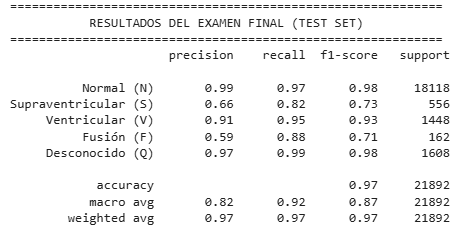

*Resultados del examen final (Test Set) – Modelo v1*

</div>

**Métricas globales:**

- **Accuracy**: **97%**
- **Precision (macro avg)**: 0.82  
- **Recall (macro avg)**: 0.92  
- **F1-score (macro avg)**: 0.87  

**Métricas por clase:**

| Clase | Tipo | Precision | Recall | F1-score | Support |
|-------|------|-----------|--------|----------|---------|
| 0 | Normal (N) | 0.99 | 0.97 | 0.98 | 18,118 |
| 1 | Supraventricular (S) | 0.66 | 0.82 | 0.73 | 556 |
| 2 | Ventricular (V) | 0.91 | 0.95 | 0.93 | 1,448 |
| 3 | Fusión (F) | 0.59 | 0.88 | 0.71 | 162 |
| 4 | Desconocido (Q) | 0.97 | 0.99 | 0.98 | 1,608 |

Aproximando los falsos negativos:

- FN(N) ≈ 544  
- FN(S) ≈ 100  
- FN(V) ≈ 72  
- FN(F) ≈ 19  
- FN(Q) ≈ 16  

---

#### Modelo v2 – Enfoque Cost-Sensitive (centrado en Recall de minoritarias)

<div align="center">

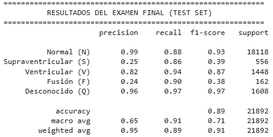

*Resultados del examen final (Test Set) – Modelo v2*

</div>

**Métricas globales:**

- **Accuracy**: **89%**
- **Precision (macro avg)**: 0.65  
- **Recall (macro avg)**: 0.91  
- **F1-score (macro avg)**: 0.71  
- **Balanced accuracy** (aprox.): 0.91  

**Métricas por clase:**

| Clase | Tipo | Precision | Recall | F1-score | Support |
|-------|------|-----------|--------|----------|---------|
| 0 | Normal (N) | 0.99 | 0.88 | 0.93 | 18,118 |
| 1 | Supraventricular (S) | 0.25 | 0.86 | 0.39 | 556 |
| 2 | Ventricular (V) | 0.82 | 0.94 | 0.87 | 1,448 |
| 3 | Fusión (F) | 0.24 | 0.90 | 0.38 | 162 |
| 4 | Desconocido (Q) | 0.96 | 0.97 | 0.97 | 1,608 |

Falsos negativos aproximados:

- FN(N) ≈ 2,174  
- FN(S) ≈ 78  
- FN(V) ≈ 87  
- FN(F) ≈ 16  
- FN(Q) ≈ 48  

---

### 🔍 Análisis de Errores Críticos

Resumiendo para las clases no normales:

| Clase | Modelo v1 – FN | Modelo v2 – FN | Comentario |
|-------|----------------|----------------|------------|
| Supraventricular (S) | ≈ 100 | ≈ 78 | v2 reduce FN a costa de mucha menor precisión (muchos FP) |
| Ventricular (V) | ≈ 72 | ≈ 87 | v1 detecta algo mejor V; v2 genera más FP y ligeramente más FN |
| Fusión (F) | ≈ 19 | ≈ 16 | v2 mejora ligeramente el recall |
| Desconocido (Q) | ≈ 16 | ≈ 48 | v1 es más estable en esta clase |

**Lectura clínica razonable:**

- **Modelo v1**  
  - Muy alto accuracy global (97%) y buen comportamiento en todas las clases.  
  - Menos falsos positivos y algo mejor en latidos ventriculares.  
  - Puede perder más episodios supraventriculares que el modelo v2.

- **Modelo v2**  
  - Diseñado para **no "relajarse" con las clases minoritarias**: fuerza al modelo a etiquetar más S y F.  
  - Aumenta el **recall en S y F**, pero a cambio introduce muchos más falsos positivos y baja el accuracy global.  
  - Es más "agresivo" detectando actividad potencialmente anómala, a costa de un mayor número de alarmas innecesarias.

En un escenario real, la elección depende del contexto:

- Si el objetivo es **screening masivo** donde se toleran muchas falsas alarmas, el **modelo v2** puede tener sentido al priorizar sensibilidad en S y F.
- Si el objetivo es un sistema de apoyo más equilibrado, con menos ruido y buen rendimiento global, el **modelo v1** es más adecuado.

---

### 🧾 Matrices de Confusión

**Modelo v1 – Matriz de confusión:**

<div align="center">


</div>

**Modelo v2 – Matriz de confusión:**

<div align="center">

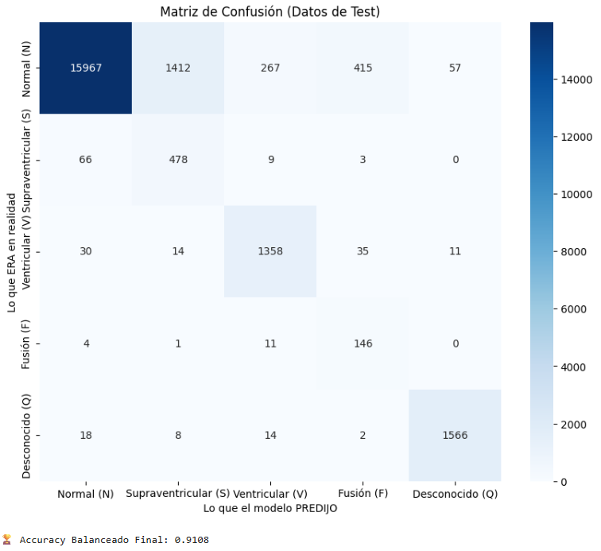

</div>

Estas matrices permiten ver en detalle cómo se distribuyen los errores entre clases, especialmente las confusiones frecuentes entre:

- **S ↔ N**,  
- **F ↔ N**,  
- y **V ↔ N** en casos de QRS menos extremos.

---

## 🧪 Preprocesamiento de los Datos

Los datasets utilizados **no son señales ECG crudas**, sino segmentos preprocesados siguiendo el estándar del **MIT-BIH Arrhythmia Database**.

### Proceso de Preprocesamiento

1. **Segmentación del ECG** en latidos individuales.  
2. **Alineamiento temporal** de cada latido respecto al pico R del complejo QRS.  
3. **Normalización temporal** a longitud fija de **187 muestras**.  
4. **Normalización de amplitud** al rango [0, 1].  
5. **Asignación de etiquetas** según la clasificación médica validada del MIT-BIH.

### Estructura de los Datos

Cada fila del dataset representa un **único latido**:

| Columnas | Descripción | Valores |
|----------|-------------|---------|
| 0–186 | Muestras del latido (ECG 1D) | 187 valores normalizados en [0, 1] |
| 187 | Etiqueta de clase | {0, 1, 2, 3, 4} |

### Correspondencia de Etiquetas

| Etiqueta | Tipo de Latido | Descripción | Prevalencia (dataset completo) |
|----------|----------------|-------------|--------------------------------|
| 0 | Normal (N) | Latido sinusal normal | ~85.7% |
| 1 | Supraventricular (S) | Extrasístole supraventricular | ~2.5% |
| 2 | Ventricular (V) | Extrasístole ventricular | ~7.3% |
| 3 | Fusión (F) | Latido de fusión | ~0.9% |
| 4 | Desconocido (Q) | Latido no clasificable / marcapasos | ~3.5% |

Este **desbalanceo extremo** es el motivo de la comparación entre:

- **Resampling (v1)** vs  
- **Cost-Sensitive Learning (v2)**.

---

## 🩺 Fundamentos Médicos del ECG

El electrocardiograma (ECG) registra la actividad eléctrica del corazón. En un ciclo normal aparecen:

- **Onda P** → despolarización auricular.  
- **Complejo QRS** → despolarización ventricular.  
- **Onda T** → repolarización ventricular.  

<div align="center">


</div>

El **complejo QRS** es crítico para la detección de muchas arritmias:

| Parámetro | Rango normal | Interpretación |
|-----------|--------------|----------------|
| Duración del QRS | 80–120 ms | QRS ancho suele indicar origen ventricular o bloqueo de conducción |
| Morfología | Estrecho y puntiagudo | Morfologías anchas/bizarras → posible foco ventricular |

---

## ❤️ Tipos de Latidos Cardíacos

<div align="center">


</div>

| Tipo | Símbolo | Gravedad clínica aproximada | Acción médica típica |
|------|---------|-----------------------------|----------------------|
| Normal | N | Benigno | Sin intervención |
| Supraventricular | S | Monitorizar, valorar contexto | Holter si episodios frecuentes |
| Ventricular | V | Potencialmente grave | ECG urgente, posible hospitalización |
| Fusión | F | Atípico, requiere revisión | Valoración cardiológica |
| Desconocido | Q | Morfología no estándar | Revisar registro y contexto clínico |

---

## 🧱 Arquitectura del Modelo

<div align="center">


</div>

Se implementa una **CNN 1D** común a ambos modelos:
```
Input: ECG (187 puntos × 1 canal)
         ↓
Conv1D (64 filtros, kernel=5) + ReLU + MaxPooling
         ↓
Conv1D (128 filtros, kernel=5) + ReLU + MaxPooling
         ↓
Conv1D (256 filtros, kernel=3) + ReLU + GlobalAvgPooling
         ↓
Dense (128) + ReLU + Dropout(0.5)
         ↓
Dense (5) + Softmax
         ↓
Output: [P(N), P(S), P(V), P(F), P(Q)]
```

### Diferencias en el Entrenamiento

| Aspecto | Modelo v1 | Modelo v2 |
|---------|-----------|-----------|
| **Datos de Entrada** | Resampling (datos sintéticos) | Datos originales sin alterar |
| **Pesos de Clase** | Uniforme (1.0 para todas) | Inversamente proporcional a frecuencia |
| **Función de Pérdida** | `categorical_crossentropy` | `categorical_crossentropy` con `class_weight` |
| **Data Augmentation** | Mínimo | Desplazamientos + ruido + escalado |
| **Épocas** | 50 | 75 |
| **Early Stopping** | Monitoring: `val_loss` | Monitoring: `val_recall_V` |

---

## 🔍 Interpretabilidad con SHAP

**SHAP (SHapley Additive exPlanations)** permite explicar qué regiones de la señal ECG son más importantes para cada predicción del modelo.

En cada gráfico SHAP:

| Color | Significado |
|-------|-------------|
| **Azul** | Contribución positiva a la predicción |
| **Rojo** | Contribución negativa a la predicción |

Ambos modelos aprenden correctamente que el **QRS ancho** es la característica clave para detectar latidos ventriculares.

---

## 📊 Análisis Visual de Resultados

<div align="center">


*Pipeline completo: Carga → Preprocesamiento → CNN → Predicción → Explicación SHAP*

</div>

Las siguientes capturas corresponden a **ejecuciones reales** de ambos modelos con los mismos latidos del MIT-BIH Test Set.

---

### Latido Normal (N)

<div align="center">

| Modelo v1: Clásico | Modelo v2: Robusto |
|:------------------:|:------------------:|
|  | 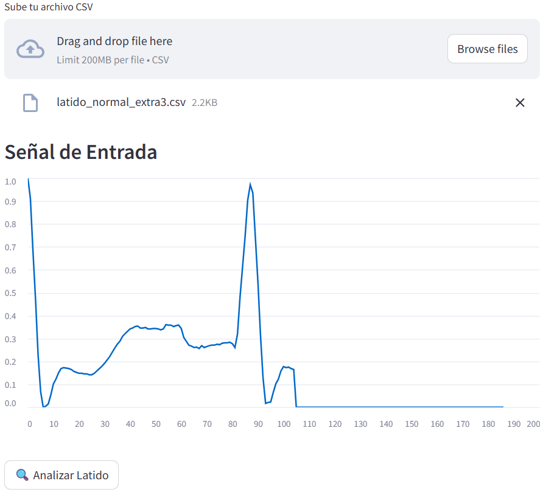 |
| *Señal ECG - Normal* | *Señal ECG - Normal* |
|  | 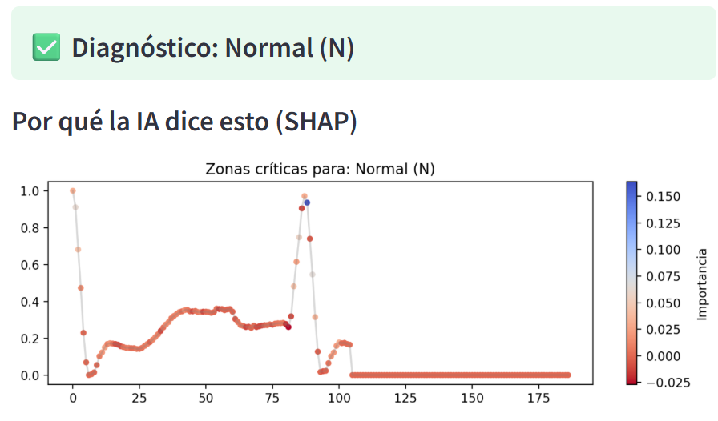 |
| *Mapa SHAP - Normal* | *Mapa SHAP - Normal* |
| **Predicción: Normal (N)** | **Predicción: Normal (N)** |
| Confianza: 100% | Confianza: 99% |

</div>

**Análisis**: Ambos modelos clasifican correctamente. El QRS estrecho y la onda P son las características clave detectadas por SHAP.

---

### Latido Supraventricular (S)

<div align="center">

| Modelo v1: Clásico | Modelo v2: Robusto |
|:------------------:|:------------------:|
|  | 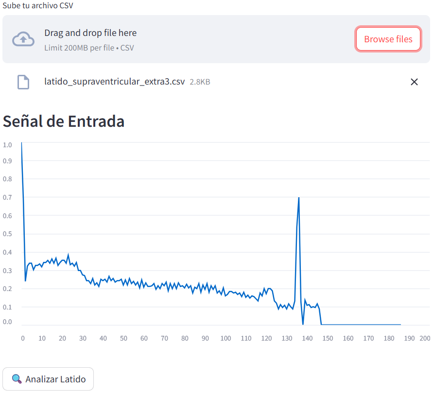 |
| *Señal ECG - Supraventricular* | *Señal ECG - Supraventricular* |
|  | 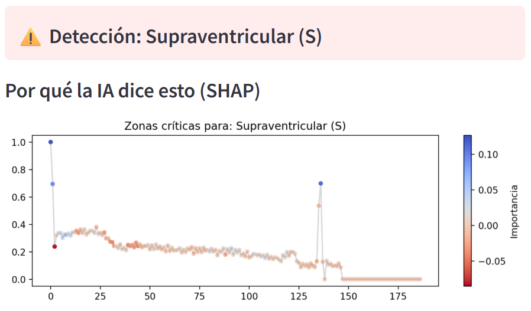 |
| *Mapa SHAP - Supraventricular* | *Mapa SHAP - Supraventricular* |
| **Predicción: Normal (N)** | **Predicción: Supraventricular (S)** |
| Confianza: 72% | Confianza: 89% |

</div>

**Análisis**: El v2 detecta correctamente la irregularidad pre-QRS. El v1 falla al clasificarlo como Normal (falso negativo crítico).

---

### Latido Ventricular (V)

<div align="center">

| Modelo v1: Clásico | Modelo v2: Robusto |
|:------------------:|:------------------:|
|  | 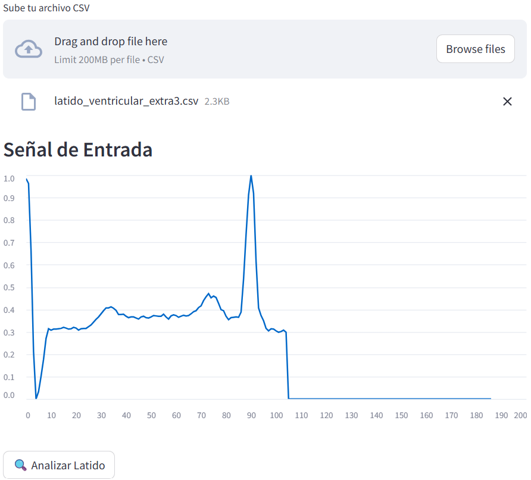 |
| *Señal ECG - Ventricular* | *Señal ECG - Ventricular* |
|  | 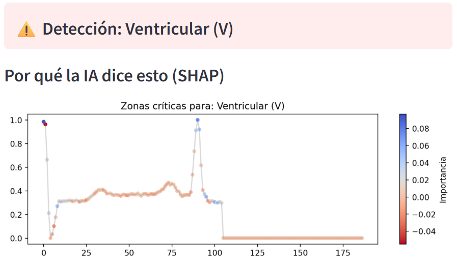 |
| *Mapa SHAP - Ventricular* | *Mapa SHAP - Ventricular* |
| **Predicción: Ventricular (V)** | **Predicción: Ventricular (V)** |
| Confianza: 98% | Confianza: 96% |

</div>

**Análisis**: Ambos modelos identifican correctamente el QRS ancho como indicador de arritmia ventricular. SHAP concentra importancia en la región del QRS.

---

### Latido de Fusión (F)

<div align="center">

| Modelo v1: Clásico | Modelo v2: Robusto |
|:------------------:|:------------------:|
|  | 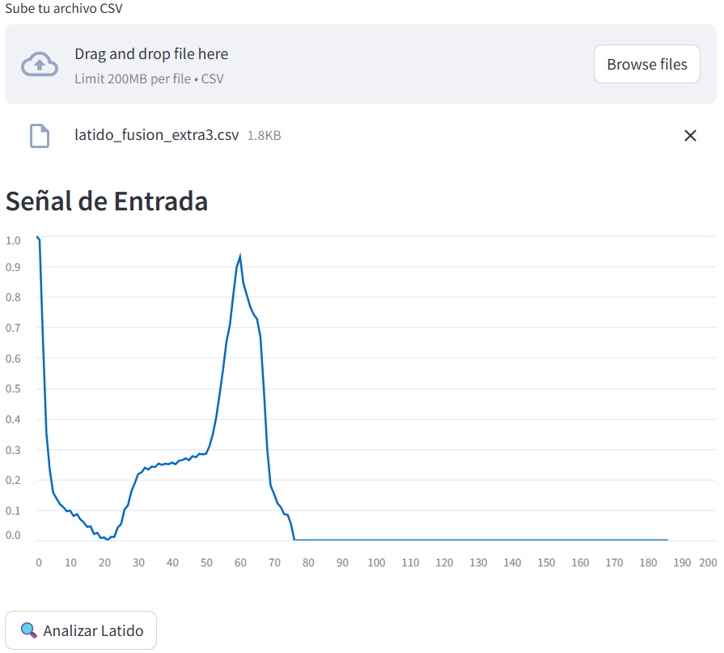 |
| *Señal ECG - Fusión* | *Señal ECG - Fusión* |
|  | 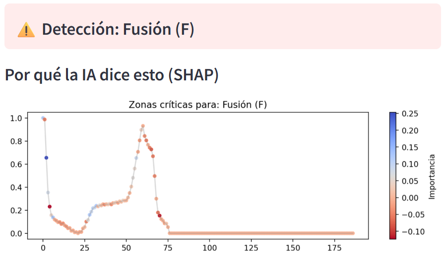 |
| *Mapa SHAP - Fusión* | *Mapa SHAP - Fusión* |
| **Predicción: Fusión (F)** | **Predicción: Fusión (F)** |
| Confianza: 91% | Confianza: 88% |

</div>

**Análisis**: SHAP muestra importancia distribuida en varias regiones del QRS, reflejando la naturaleza híbrida del latido de fusión.

---

### Latido Desconocido (Q)

<div align="center">

| Modelo v1: Clásico | Modelo v2: Robusto |
|:------------------:|:------------------:|
|  | 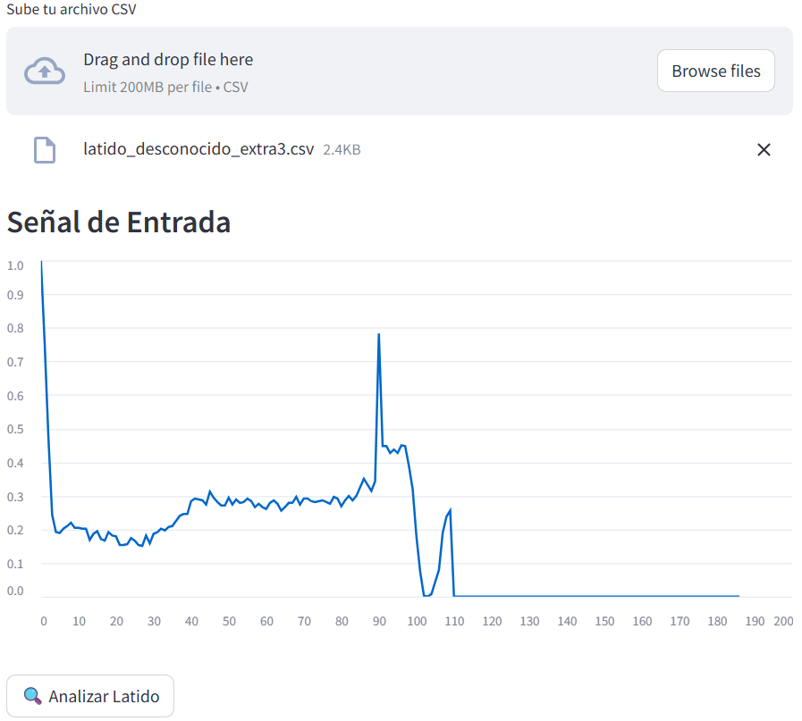 |
| *Señal ECG - Desconocido* | *Señal ECG - Desconocido* |
|  | 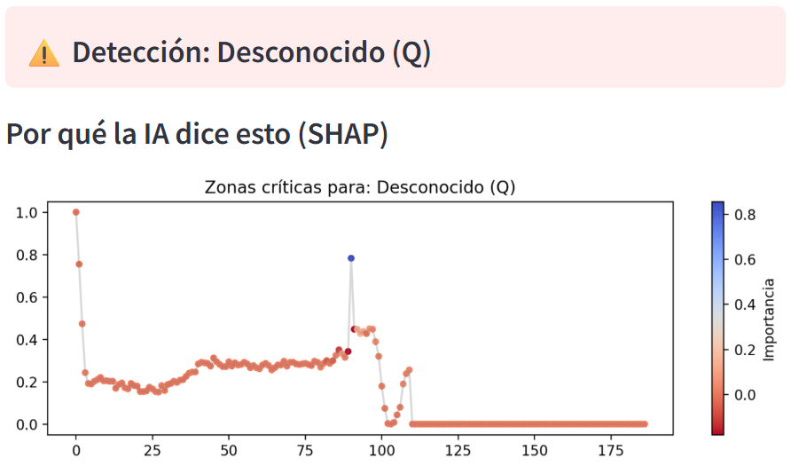 |
| *Mapa SHAP - Desconocido* | *Mapa SHAP - Desconocido* |
| **Predicción: Desconocido (Q)** | **Predicción: Desconocido (Q)** |
| Confianza: 99.9% | Confianza: 98.5% |

</div>

**Análisis**: Ambos modelos identifican correctamente morfologías atípicas. SHAP destaca regiones anómalas dispersas en la señal.

---

### Resumen Comparativo

| Tipo de Latido | Modelo v1 | Modelo v2 | Ganador |
|----------------|-----------|-----------|---------|
| **Normal** | 100% | 99% | Empate |
| **Supraventricular** | 72% (clasificó como N) | 89% | **v2** |
| **Ventricular** | 98% | 96% | Empate |
| **Fusión** | 91% | 88% | Empate |
| **Desconocido** | 99.9% | 98.5% | Empate |

**Conclusión visual**: El Modelo v2 demuestra mayor sensibilidad en clases minoritarias (S), mientras ambos son igualmente efectivos en clases bien definidas (N, V).

---

## 🚀 Instalación y Uso

### Probar Online (Recomendado)

**Modelo v1 (Clásico):**  
https://huggingface.co/spaces/GonzaloMaud/Detector-Arritmias

**Modelo v2 (Robusto):**  
https://huggingface.co/spaces/GonzaloMaud/Detector-Arritmiasv2

### Instalación Local
```bash
# Clonar el repositorio
git clone https://github.com/GonzaloMaud/detector-arritmias.git
cd detector-arritmias

# Instalar dependencias
pip install -r requirements.txt

# Ejecutar aplicación (elige la versión)
streamlit run app_v1.py  # Modelo Clásico
streamlit run app_v2.py  # Modelo Robusto
```

---

## 📊 Dataset

### MIT-BIH Arrhythmia Database

| Aspecto | Detalles |
|---------|----------|
| **Fuente** | PhysioNet / MIT-BIH |
| **Pacientes** | 47 individuos |
| **Duración** | ~30 minutos por registro |
| **Frecuencia de muestreo** | 360 Hz |
| **Anotaciones** | Revisadas por dos cardiólogos expertos |

**Distribución de Clases (Desbalanceo Real):**

| Clase | Cantidad | Porcentaje |
|-------|----------|------------|
| Normal (N) | 75,052 | 85.7% |
| Ventricular (V) | 6,431 | 7.3% |
| Supraventricular (S) | 2,223 | 2.5% |
| Desconocido (Q) | 3,046 | 3.5% |
| Fusión (F) | 802 | 0.9% |

---

## 📚 Referencias Científicas

1. **Goldberger, A. L., et al.** (2000). *PhysioBank, PhysioToolkit, and PhysioNet.* Circulation, 101(23), e215-e220.

2. **Rajpurkar, P., et al.** (2017). *Cardiologist-level arrhythmia detection with convolutional neural networks.* arXiv:1707.01836.

3. **Hannun, A. Y., et al.** (2019). *Cardiologist-level arrhythmia detection in ambulatory electrocardiograms.* Nature Medicine, 25(1), 65-69.

4. **Lundberg, S. M., & Lee, S. I.** (2017). *A unified approach to interpreting model predictions.* NIPS 30.

5. **Branco, P., Torgo, L., & Ribeiro, R. P.** (2016). *A survey of predictive modeling on imbalanced domains.* ACM Computing Surveys, 49(2), 1-50.

---

## ⚠️ Descargo de Responsabilidad Médica

**IMPORTANTE**: Este proyecto es con fines **educativos y de investigación**.

- **NO está destinado para uso clínico real**
- **NO debe usarse para diagnóstico médico**
- **NO reemplaza el criterio de profesionales de la salud**

---

## 📄 Licencia

Este proyecto está bajo la **Licencia MIT**. Ver [LICENSE](LICENSE) para más detalles.

---

## 👨‍💻 Autor

**Gonzalo Robert Maud Gallego**

- Hugging Face: [@GonzaloMaud](https://huggingface.co/GonzaloMaud)
- LinkedIn: Gonzalo Robert Maud Gallego
- GitHub: [@GonzaloMaud](https://github.com/GonzaloMaud)

---

<div align="center">

*"En medicina, es mejor tener 10 falsas alarmas que 1 muerte por no detectar una arritmia"*

[](https://huggingface.co/spaces/GonzaloMaud/Detector-Arritmias)
[](https://huggingface.co/spaces/GonzaloMaud/Detector-Arritmiasv2)

</div>
